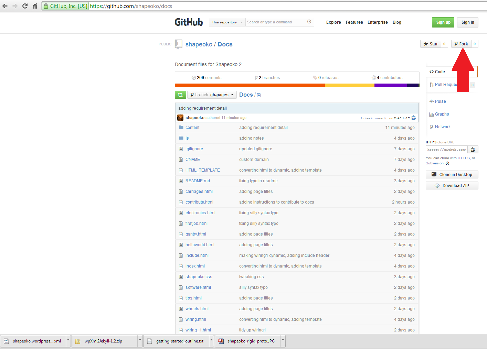
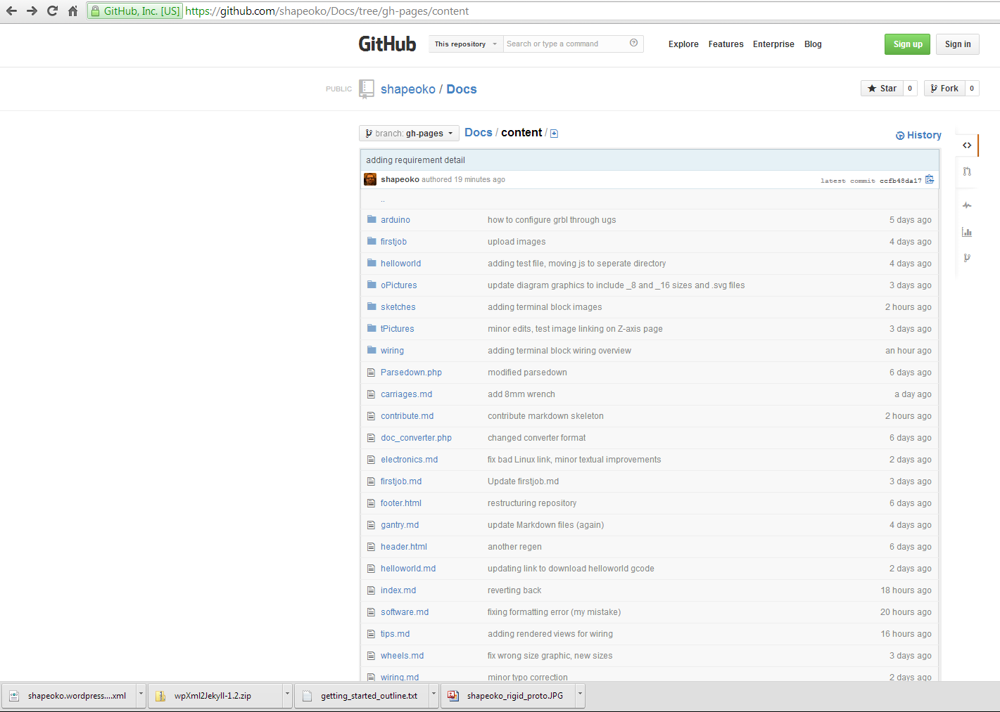
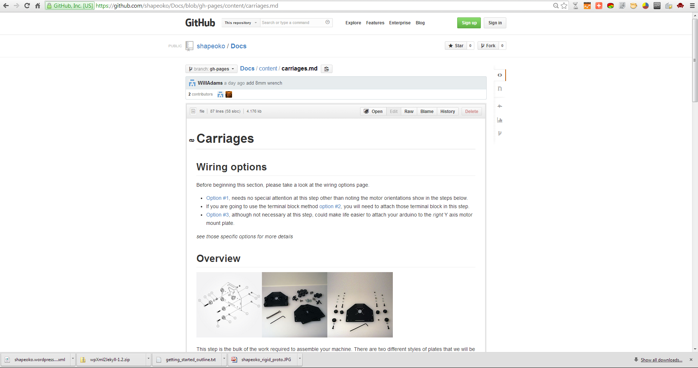
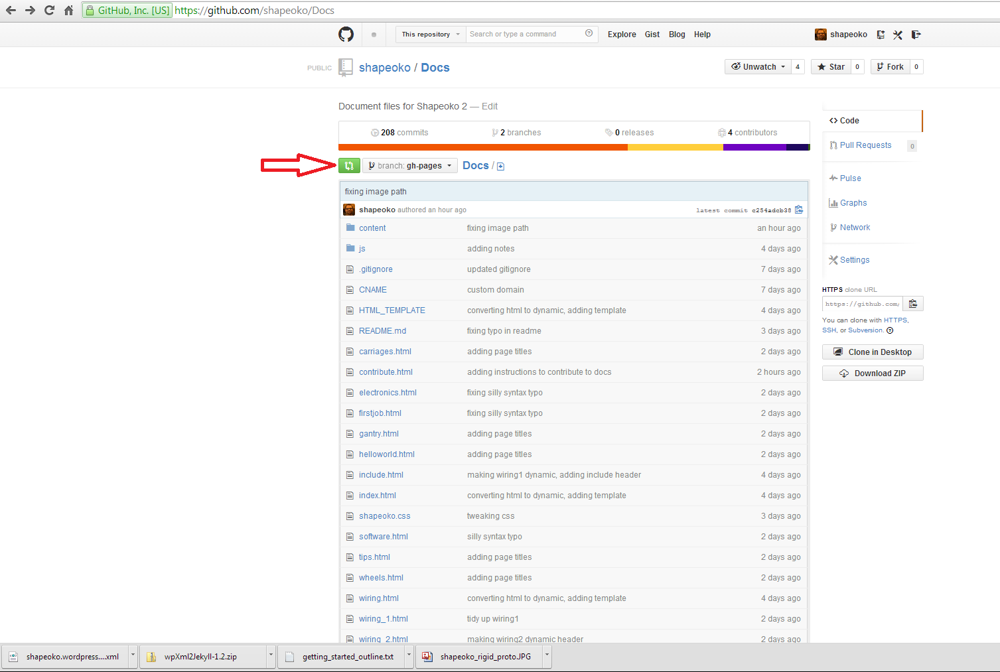

#What is this?

The assembly documents for Shapeoko 2 are stored in a github repository as markdown files. You can learn more about markdown [here](http://daringfireball.net/projects/markdown/). I chose to store the documents this way for several reasons, some are debatable, some are purely subjective.

##How to Contribute

So you want to help by contributing to the documentation? Great! Our project was built on community contributions. It's actually pretty easy. The idea is this:

1. Fork the [shapeoko/docs repository](https://github.com/shapeoko/Docs). 
2. Make changes to your **forked** copy of the repository
3. Issue a Pull Request
4. Feel happy for helping contribute to Project Shapeoko!

##Fork the repository

###Forking - it's not as dirty as it sounds

Forking means to copy the repository into your account. It's a little more awesome than just copying though. You are actually copying the **ENTIRE** repository, including all of the commit history. So you literally will have an identicle copy of the repository at the time you fork it. Cool right?

##Add your contributions

Once the repository is forked, you can go to town with edits. For our purposes, we will only be editing the markdown files. These are the files that end in .md. You will find these in the contents/ directory. 

Once you make your changes, and you want them to be part of the main docs.shapeoko.com page, all you have to do is issue a pull request.

###There are a couple ways to edit the files. 

The easiest way is to simply use the built in editor! Just click on whatever file you want to edit, and then click the 'edit' button at the top of the pane.

Another way is through your favorite text editor. To do it this way, you'll need to install the github for (mac/windows) client, and work from there. Committing your changes as you go.

Once you have made some changes, you can submit a pull request. 

##Issue a Pull Request

###Pull Request - means basically what it says "Please pull my changes into your repository"

To do a pull request from github.com, click the **Compare & Review** button at the top of your repository

From this page, you can review what changes you made, and submit a pull request by clicking the pull request button. Be sure to include a description of your changes. 

##Bringing it all together

Once the pull request has been submitted, it will be reviewed by a member of the Shapeoko team. We might just push it right through, or we might need to get back with you with some change requests before we can merge your content with the main repositories. But, either way, if you have content to add, we'll be happy to help you get it added.