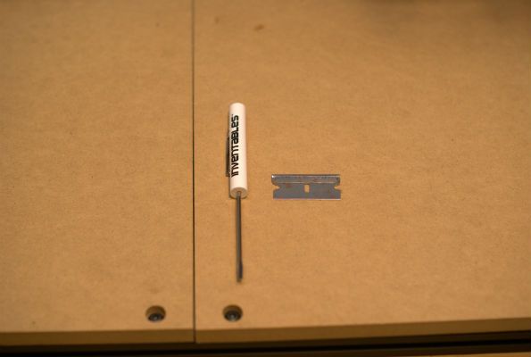
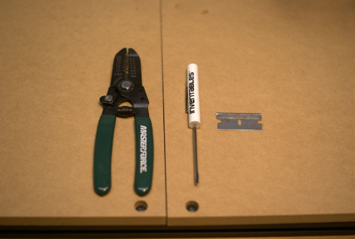
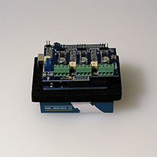
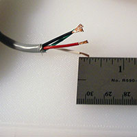
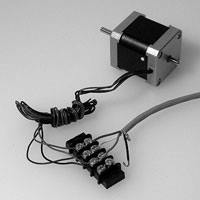
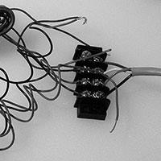
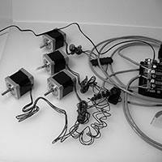
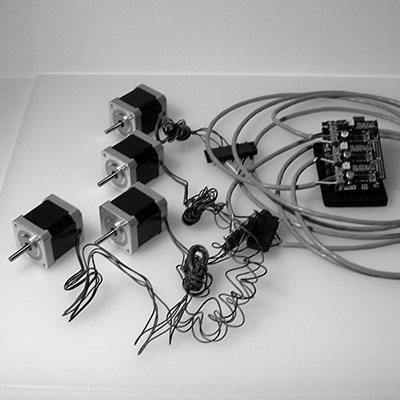
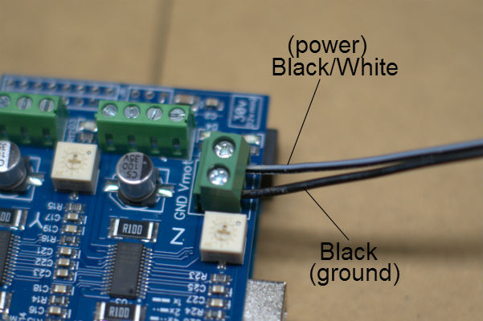

# Testing Electronics

## Overview

 

Before we get all crazy bolting our new machine together, let's give our electronics a test run. It would be frustrating to have the machine fully assembled, only to find that there is a problem with your electronics that may require disassembly! Let's cut that off at the pass and give everything a thorough checking first.

For reference, the image below shows the concept of wiring Shapeoko 2.

_For simplicity, the above wiring diagram omits the (optional) terminal blocks for the X- and Z-axis._

**N.B., stepper driver chips are fragile and may be damaged by applying power without a motor connected --- always wire things up completely, and verify all connections each time before applying power.**

Please note that stepper motors can be wired up in many different ways and still function, though the motors may turn in the reverse of the desired direction (stepper motors are reversed by swapping pairs of wires). The diagram shows one such method, which should result in correct motor rotation. The idea is to follow the wiring diagram which should "just work" --- the important thing is to follow one consistent technique when wiring the machine initially, being certain to maintain the pairing of the wires, then if need be, one can alter the wiring to correct the direction of rotation, or [change the settings in Grbl](http://www.shapeoko.com/wiki/index.php/Grbl#Invert_Bits).

## Requirements

* **Arduino with Grbl firmware** (contains an AVR processor, USB connector and I/O pins)
* (Arduino) **gShield** (formerly GrblShield, takes the signals Grbl generates and drives the steppers. Small pots are used to adjust)
* **Stepper motors** x 4 pcs
* **Power Supply** with wall plug
* **Barrel Connector** (for connecting the power supply to the gShield)
* Computer with a **Grbl Communication/Control program** installed
* **USB Cable** (A to B)
* Patience (just a little bit)

Please note that the photos depict using terminal blocks to connect the wiring --- this is optional and included to cover the case of motors with short lead wires which would require them. The 4-conductor cable should be 18 or 20 gauge and shielded. Note that in addition to the 4 color-coded copper conductors there is a steel "drain wire" which may optionally be connected to ground at the controller end, but should be trimmed off with the shielding at the motor end.

## Tools

* Screw Driver 2.0mm blade
* razor blade
* (optional shown) Wire strippers
* (optional and not shown) Multimeter for testing continuity

The terminal blocks use a combination screw which will accept either a Phillips or flat blade screwdriver.

##Connect Arduino

Now that we have everything gathered up, you should find yourself with a setup similar to this:

First thing that we do is plug our Arduino into the computer and test it. If you are confident your Arduino works, skip to **Hook Stuff Up** below.

Remember, the big end of the cable goes into the Arduino. Loading the driver for the Arduino is documented in [Software](http://docs.shapeoko.com/software.html)

##Communication / Control Program

Launch your selected Communication/Control program on your computer. Connect to the Arduino and ensure that it works (see the [Software](software.html) page for details). Once you are certain your controller works, disconnect it.

##Hook Stuff Up##

The next step is to plug the Arduino into the gShield. Be careful of the electronics, not to bend any pins, or to allow static electricity to damage them.

You will need to connect the gShield to the stepper motors. This may be done using the terminal blocks and 4 conductor grey wire as shown in the photographs, or directly if your stepper motor leads are long enough. If your stepper motor has very long wires you will have the option of choosing whether to use the terminal blocks (placing them on the gantry), or directly connecting the motors to the electronics. If the wires are short, then the terminal blocks will need to be attached to the gantry. Wiring your stepper motors to terminal blocks on the gantry minimizes the wear and tear on the motor leads, limiting it to the 4 conductor grey wire, while directly connecting the leads provides for a neater appearance.

Start by cutting the grey wire to length (either equal thirds, or some proportion which takes into account the wire for the Y-axis having a slightly shorter run than the X- and Z-axes). If you have long leads, it is best to defer cutting the wire until it is mounted on the machine --- that will allow you to make a run with the un-trimmed wire and then cut it to the exact length. If you make a mistake and need more wire, this may be ordered from Inventables or sourced from any hardware store (just buy 4 conductor 20 (or 18) gauge security wire).

Next, strip all of the wire ends. The ends which will attach to the terminal block should be approximately 3/8" so as to be twisted into a hook so as to wrap around the terminal block screws (trim away all of the shielding and the steel drain wire at this end). The other end of the grey wire should be stripped approximately 1/4" of an inch so as to fit into the gShield. Be careful of stripping too much and leaving wire unnecessarily exposed which could create the possibility of a short. If you wish to ground the drain wires you will need to strip off enough of the coverings to connect them to ground and trim any excess of the other wires.

Next, loosen up all the screws on one terminal block, then begin making connections by twisting the wire ends into hooks, hooking them onto the screws oriented so that the turning of the screw will tighten them and tighten the wire.

Make all connections in the same colour order. Shown in the wiring diagram is:

* Black (swap this first pair to reverse the second Y-axis motor)
* Green
* Red
* Blue/White

Since the ShapeOko 2 uses two motors on the Y-Axis and the gShield only has 3 stepper drivers, it is necessary to wire the two motors to one stepper connector block (or terminal block as shown below). Note that it is necessary to reverse one pair of wires so that the motors will run in opposite directions when placed on the gantry in opposite orientations.

Carefully make each connection. Be careful not to lose any screws. If necessary, trim wires and re-strip so as to achieve a good connection.

Next, connect the grey wires from the terminal blocks to the stepper motors. Make all of the connections initially in the same order. Later, when configuring the machine, it may be necessary to swap wires around so as to achieve the desired direction of rotation.

Please note the gShield takes two different sizes of screwdriver. 1/8" for the screws in the power connector (2 screws, may be blue or green), 3/32" for the screws in the stepper motor connectors (4 screws, should be green).

The stepper motor connectors should be unscrewed so as to open them up as the right-most connector is below.

Carefully connect the grey wires from the stepper motors (be gentle since you do not want to crack the circuit boards or dislodge any components). Note that each such block represents one axis. Be certain to connect the dual-motor Y-Axis to the correct block. 

Once completed, all wires will be connected and none will be loose. It is important that the wires be connected securely since the various parts will be in motion, and applying power to a stepper driver which is not connected to a motor may damage the gShield (or the stepper driver if using a shield which uses discrete stepper drivers).

Examine the connections once you are done for possible shorts and remake any connections which do not seem safe and secure. If you have a multimeter you may wish to test the connections for continuity.

###Power###

**Be careful with the power supply, and don't work on power wires when the power supply is plugged in.**

**Caution:** Please note that the 24V power supply has a connector which matches the Arduino's 5V power supply connection --- it must not be plugged into said connector. The Arduino is able to draw its power over the USB connection, so the power connector on the Arduino is not used.

Lastly one must connect the power. First, strip the leads from the raw end of the barrel connector plug, it may also be necessary to split the lead at the end so as to allow it to neatly connect to the power connector on the gShield. If you don't have a Power Pigtail/barrel connector plug adapter (30313-01) then you will have to directly connect your power supply to the gShield.

Connect it to the gShield (which is attached to the top of the Arduino). There are two leads, one a solid black wire, the other black with a white stripe (or red). 

* black == (-)
* black/white (or red) == (+)

Please connect each lead to the appropriate side of the gShield's power connector.

Plug the barrel connector into the matching connector from the power supply, plug the power supply's power connector into a grounded outlet. Your gShield should light up blue and be ready for operation.

##Testing##

Attaching tape to the motor shafts makes it easier to see the rotation when testing before the machine is assembled, or you could attach the pulleys (these are mounted so that the flat portion is at the end of the shaft and the set screw is closer to the motor housing). Once the machine is assembled, it is a good idea to retest so as to verify the connections and direction of rotation. When initially testing a machine, place it in a neutral position with space to move up, down and to all four sides, so as to prevent a crash if it should move in the wrong direction or farther than expected.

Load up a Communication / Control program and use its jog functionality to test each Axis. For the Universal G-Code Sender, this would typically involve opening the connection on the correct COM port, selecting baud rate of 9600, then switching to the "Machine Control" tab, and using the buttons to move the X-, Y-, and Z-axes. 

If one or more motors don't move or don't move smoothly, you may need to adjust the trim pots on the gShield, see [the Motor Current section of the Tuning page on the wiki](http://www.shapeoko.com/wiki/index.php/Tuning#Motor_Current).

As viewed with the shaft pointing toward you, when moving the respective axis in the positive direction, the motors of a Shapeoko 2 should turn counterclockwise with the exception of the Y-axis right motor which should turn clockwise.
 
Note that once the machine is assembled, the positive direction for X is right, for Y it's away from you, and for Z it's up.

###Go For a Spin###

Z-Axis --- (Counterclockwise) Note that when testing, the Z-axis should turn for a longer duration than the other axes since the screw requires more revolutions to move a given distance than the belts used on the X- and Y-axes. With the standard drive (M8 on Z, 20-tooth GT2 on X and Y), for the same distance travelled, the Z motor turns 8 times more than the X and Y motors.

###Another Spin###

X-Axis --- (Counterclockwise) the X- and Y-axis should move for the same duration for a given degree of movement.

###And a Final Spin###

Y-Axis --- (Both Clockwise and Counterclockwise) make certain that the two motors for the Y-axis are rotating in opposite directions --- the one which is for the right side of the gantry should turn clockwise, the one for the left should turn counter-clockwise.

---

Once everything has been successfully tested you should dismantle at least the terminal block connections and carefully set everything aside until it's needed.

Once everything has been successfully assembled you should re-test jogging all the axes to ensure that movement is properly calibrated in terms of direction/rotation and distance travelled/number of steps/revolutions.

For troubleshooting possible issues with your steppers, see [the stepper section of the Assembly Troubleshooting page](http://www.shapeoko.com/wiki/index.php/Assembly_troubleshooting#Motors_Spin_in_Wrong_Direction) for information on wiring stepper motors.
 
###Next step [Wheels & Idlers](wheels.html)

To express concerns, post on the [forums](http://www.shapeoko.com/forum/index.php), to suggest improvements without using github, edit [this wiki page](http://www.shapeoko.com/wiki/index.php?title=Electronics_2&action=edit&redlink=1).
