# Testing Electronics
## Overview
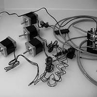 

Before we get all crazy bolting our new machine together, let's give our electronics a test run. It's frustrating to have the machine fully assembled, only to find there is a problem with your electronics that may require disassembly! Let's cut that off at the pass and give everything a thorough checking first.

For reference, the image below shows the concept of wiring Shapeoko 2.

_For simplicity, the above wiring diagram omits the (optional) terminal blocks for the X- and Z-axis._

**N.B., stepper driver chips are fragile and may be damaged by applying power without a motor connected --- always wire things up completely, and verify all connections each time before applying power.**

Please note that stepper motors can be wired up in many different ways and still function, though the motors may turn in the reverse of the desired direction (stepper motors are reversed by swapping pairs of wires). The diagram shows one such method, which will result in correct motor rotation, and the photos which follow may show other methods (which may or may not). The ideal is to follow the wiring diagram which will "just work" --- the important thing is to follow one consistent technique when wiring the machine initially, being certain to maintain the pairing of the wires (see [this page](http://www.linengineering.com/resources/wiring_connections.aspx) for information on wiring stepper motors), then if need be, one can alter the wiring to correct the direction of rotation if need be.

## Requirements

* **Arduino with Grbl firmware** (contains an AVR processor, USB connector and I/O pins)
* (Arduino) **gShield** (formerly GrblShield, takes the signals Grbl generates and drives the steppers. Small pots are used to adjust)
* **Stepper motors** x 4pcs
* **Power Supply** with wall plug
* **Barrel Connector** (for connecting the power supply to the gShield)
* Computer with a **Grbl Communication/Control program** installed
* **USB Cable** (A to B)
* Patience (just a little bit)

Please note that the photos depict using terminal blocks to connect the wiring --- this is optional and included to cover the case of motors with short lead wires which would require them. The 4-conductor cable should be 18 or 20 gauge and shielded. Note that in addition to the 4 color-coded copper conductors there is a steel "drain wire" which may optionally be connected to ground at the controller end, but should be trimmed off with the shielding at the motor end.

## Tools

* Screw Driver 2.0mm blade
* razor blade
* (optional shown) Wire strippers
* (optional and not shown) Multimeter for testing continuity

The terminal blocks use a combination screw which will accept either a Phillips or flat blade screwdriver.

##Connect Arduino

Now that we have everything gathered up, you should find yourself with a setup similar to this:

First thing that we do is plug our Arduino into the computer.

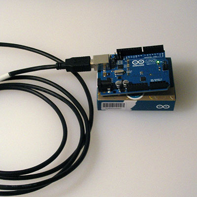

Remember, the big end of the cable goes into the Arduino. Loading the driver for the Arduino is documented in [Software](http://docs.shapeoko.com/software.html)

##Communication / Control Program

Launch your selected Communication/Control program on your computer. Connect to the Arduino and ensure that it works (see the [Software](software.html) page for details). Once you are certain your controller works, disconnect it.

##Hook Stuff Up##

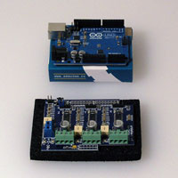
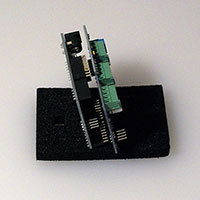

The next step is to plug the Arduino into the gShield. The Arduino will run Grbl, while the gShield will be connected to the stepper motors and will control them. Be careful of the electronics, not to bend any pins, or to allow static electricity to damage them.

You will need to connect the gShield to the terminal blocks (using the 4 conductor grey wire) and the terminal blocks to the motors. If you have very long wires coming off of the stepper motors you will have the option of choosing where the terminal blocks are placed, either on the gantry, or connected to the electronics. If the wires are short, then the terminal blocks will need to be attached to the gantry. On the gantry minimizes the wear and tear on the motor leads, limiting it to the 4 conductor grey wire (this is easily sourced at any home improvement store), while hiding the terminal blocks away, or directly connecting the leads if long enough, provides for a neater appearance.

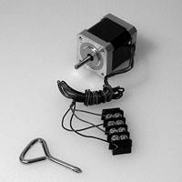

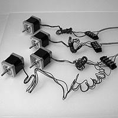

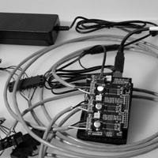

Start by cutting the grey wire to length (either equal thirds, or some proportion which takes into account the wire for the Y-axis having a slightly shorter run than the X- and Z-axes.

Next, strip all of the wire ends. The ends which will attach to the terminal block should be approximately 3/8" so as to be twisted into a hook so as to wrap around the terminal block screws (trim away all of the shielding and the steel drain wire at this end). The other end of the grey wire should be stripped approximately 1/4" of an inch so as to fit into the gShield. Be careful of stripping too much and leaving wire unnecessarily exposed which could create the possibility of a short. If you wish to ground the drain wires you will need to strip off enough of the coverings to connect them to ground and trim any excess of the other wires.

Next, loosen up all the screws on one terminal block, then begin making connections by twisting the wire ends into hooks, hooking them onto the screws oriented so that the turning of the screw will tighten them and tighten the wire.

Make all connections in the same colour order. Shown is:

* Red
* Blue/White (as shown in the photo)
* Green (Please match the other 3 colours and pair this odd twain to match the diagram)
* Black

Since the ShapeOko 2 uses two motors on the Y-Axis and the gShield only has 3 stepper drivers, it is necessary to wire the two motors to one terminal block as shown below. Note that it is necessary to reverse one pair of wires so that the motors will run in opposite directions when placed on the gantry in opposite orientations.

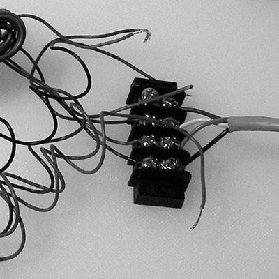

(red and blue to make purple was selected was selected for the photo, but green and black are reversed in the wiring diagram)

Carefully make each connection. Be careful not to lose any screws. If necessary, trim wires and re-strip so as to achieve a good connection.

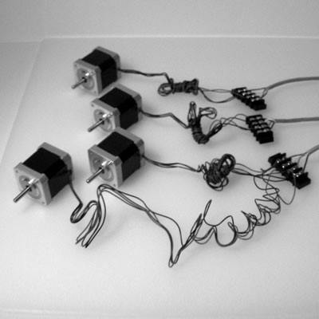

Next, connect the grey wires from the terminal blocks to the stepper motors. Make all of the connection initially in the same order. Later, when configuring the machine, it may be necessary to swap wires around so as to achieve the desired rotational direction.

Please note the gShield takes two different sizes of screwdriver. 1/8" for the screws in the blue power connector, 3/32" for the screws in the green stepper motor connectors.

The green stepper motor connectors should be unscrewed so as to open them up as the right-most connector is below.

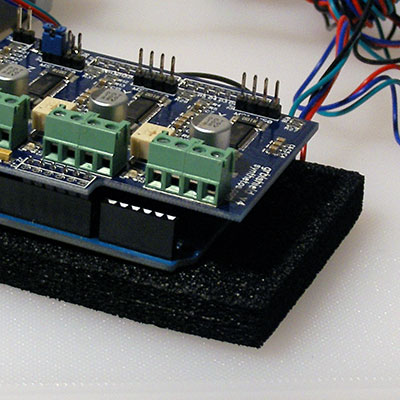

Connect the grey wires from the stepper motors. Lastly one must connect the power. Note that each green block represents one axis. Be certain to connect the dual-motor Y-Axis to the correct block.

Once completed, all wires will be connected and none will be loose. It is important that the wires be connected securely since the various parts will be in motion, and applying power to a stepper driver which is not connected to a motor may damage the driver.

If you have a multimeter you may wish to test the connections for continuity.

###Power###

_Be careful with the power supply, and don't work on power wires when the power supply is plugged in._

**Caution:** Please note that the 12V power supply has a connector which matches the Arduino's 5V power supply connection --- it must not be plugged into said connector. The Arduino is able to draw its power over the USB connection, so the power connector on the Arduino is not used.

First, strip the power lead, it may also be necessary to split the lead at the end so as to allow it to neatly connect to the power connector on the gShield.

Connect it to the Arduino. There are two leads, one a solid black wire, the other black w/ a white stripe. 

* black == (-)
* black/white == (+) (or red)

Please connect each lead to the appropriate side of the gShield's blue power connector.

Plug the barrel connector into the matching connector from the power supply, plug it into a grounded outlet. Your gShield should light up blue and be ready for operation.

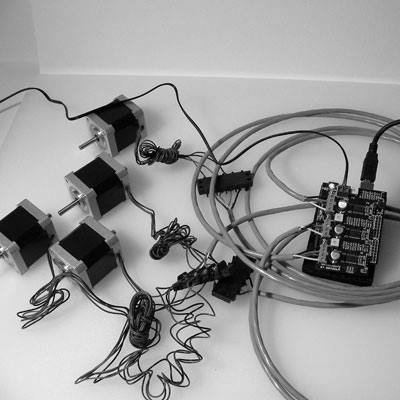

##Testing##

Attaching tape to the motor shafts makes it easier to see the rotation.

Load up a Communication / Control program and use its jog functionality to test each Axis.

###Go For a Spin###

Z-Axis

###Another Spin###

X-Axis

###And a Final Spin###

Y-Axis --- make certain that the two motors for the Y-axis are rotating in opposite directions.

Once everything has been successfully tested you should dismantle at least the terminal block connections and carefully set everything aside until it's needed.

###Next step [Wheels & Idlers](wheels.html)
