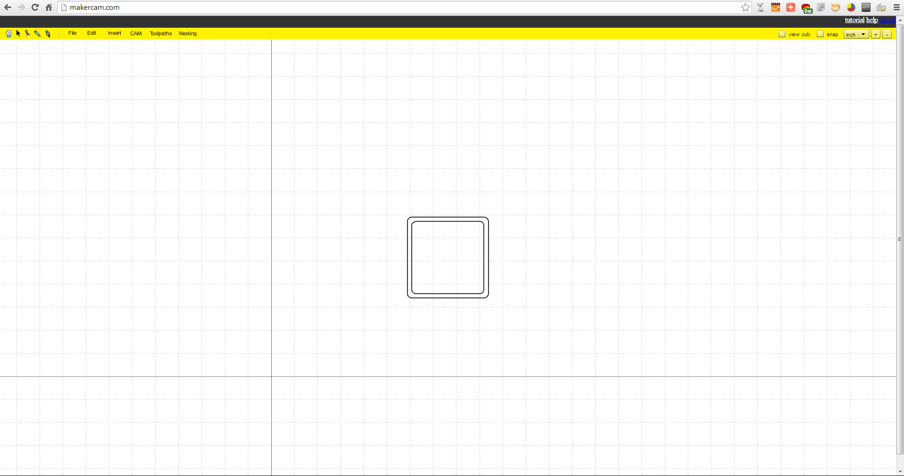
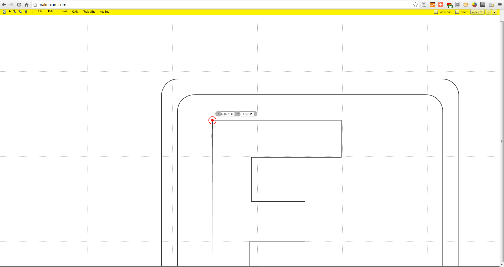
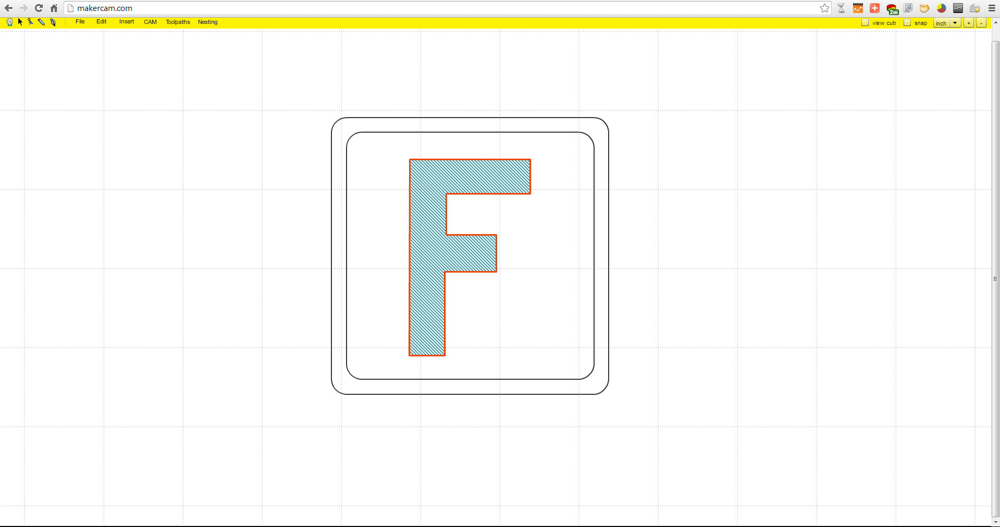
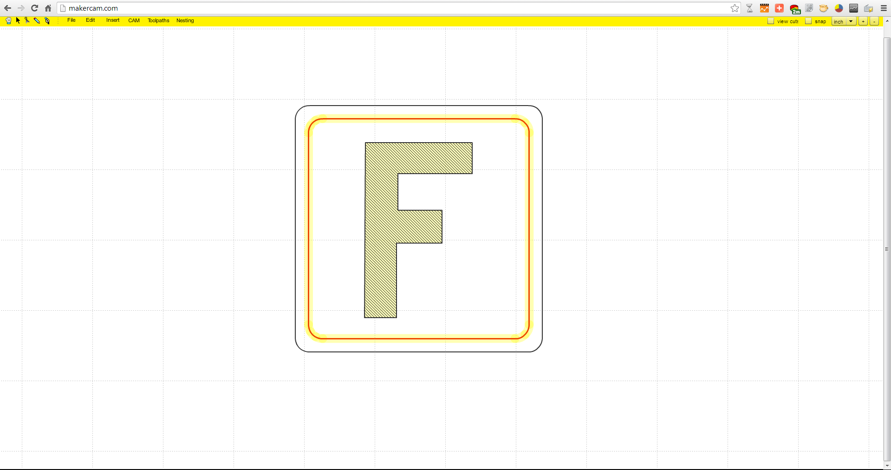
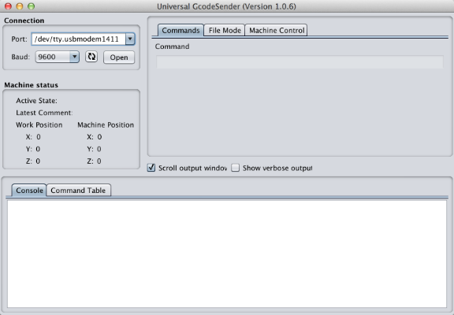

#Getting Started

Welcome to Your New Life! After completing this step, you'll be a pro! OK, maybe not a pro, but you will be capable of designing a simple part, generating appropriate toolpaths, and cutting said toolpaths on your Shapeoko 2. This is exciting, get ready!

##Find the Origin

Step #1: Open makerCAM.com. Zoom out until you can see the origin. The origin is 0,0 in the cartesian coordinate system, it's where the X and Y axis meet. In the CAM world, the origin is where your machine is going to start from.

##Create a Rectangle

Select Insert -> Rounded Rectangle. When the dialog box comes up, input 3.5 for both the length and width. leave the radius as 0.2. Click OK. You now have a rounded rectangle!

##Another Rectangle

Select Insert -> Rounded Rectangle. When the dialog box comes up, input 3.125 for both the length and width. leave the radius as 0.2. Click OK. You now have another rounded rectangle! Move the rounded rectangle so the bottom left corner is slightly inside of the bigger rectangle. Like this:

##Draw Freehand

Select the pencil tool from the toolbar in the top left corner of the screen. Use it to draw the first letter of your last name. Draw it in block style. It might take a few tries. If you mess up, switch to the pointer tool, select your line and press 'delete' on your keyboard. Once you have a rough shape of your letter, take a step back and have a look. A little rough isn't it? That's OK, it's a start!

#Prettify Your Freehand

Take the pointer tool with the circle on the end, and start working your letter into shape. Zoom in, and hover over one of the corners. See the red dot? Now you can click and drag that red dot until your line is straight (or in the shape you want it). If you put that red dot onto another one, it will join the two lines together. Now we're getting somewhere! Once you're happy with the letter, go ahead and center it inside the rectangles.

##Engrave Your Letter

Select your letter with the pointer tool. Once it's selected, the border will turn orange. Now, take a deep breath, we're going to make our first toolpath! Click CAM -> Pocket. Fill in the following values then click OK. Your letter should look like it's filled in with a hatch pattern.

##Engrave the Border

Select the inside rounded rectangle (the one we made in step #3). Click CAM -> Follow Path Operation. Fill in the following values, then click OK. Your line will be highlighted yellow.

##Create a Profile

Select the outside rounded rectangle (the one we made in Step #2). Click CAM -> Profile Operation. Fill in the following values, then click OK.

##Position Coaster at Origin

In makerCAM, position your coaster just off of the origin point.

##Generate G-Code

It's time to generate your G-code! If you check the "view cuts" option in the top right portion of the screen, your toolpaths will be filled with nice colors representing the operations. If everything looks OK, go ahead and click CAM -> calculate all. Nice work.

##Export G-Code

Export Your g-code! Your coaster should look a little goofy right now, with colors and curves representing the toolpaths. That's OK, imagine those toolpaths as a map for your bit to follow. Once you have calculated all toolpaths, let's go ahead an export the file. Click CAM -> export g-code. A couple of things to remember on this screen.

##Open Software
Just like we did in the Hello World section, plug the power in to your machine and open Universal Gcode Sender on your computer. Once the program has loaded, plug in the USB cord to your computer and you should hear the stepper motors engage.

##Open Connection Between Computer and Machine
Select the correct com port and baud rate from the drop down menus on the left.  Click 'Open' to establish a connection with the Arduino.  GRBL says hello by displaying its version number.

##Open File
Browse for the file you just exported from makerCAM.

##Verify File
Click the visualize button, located just below the browse button, to see what the file will look like. After a few seconds, a screen similar to the one below will display, which you can interact with by left clicking and dragging your mouse around.

##Set Zero Position
If your file visualization looks correct, close the visualizer and click the 'machine control' tab towards the top of the window.

Jog your machine to the lower left side of your work surface using the different axis control buttons. Click the 'Reset Zero' button to tell your machine that you are at 0,0. You should notice on the left of the panel your work position coordinates will be set to X:0, Y:0, Z:0

##Air Cut
Just to make sure, lets draw this in the air.  Click the 'File Mode' tab at the top of the program window. With the spindle ~1" above the work surface, click the 'Send' button just below the file path.

You should see Universal Gcode Sender start streaming the file, and your machine should start moving around.

##Run Job!
Lower your spindle so it's <i>just</i> ***touching*** the material.

OK, here we go. Take a deep breath and click the 'Send' button.

