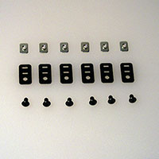
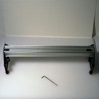
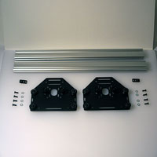
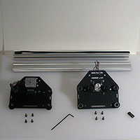
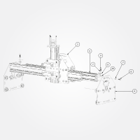
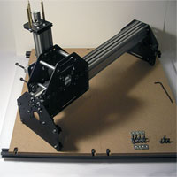
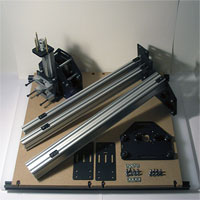
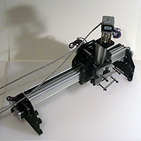
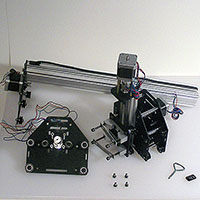
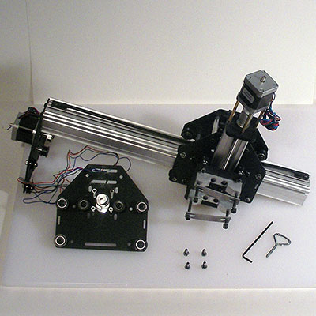

# Gantry

##Sub Gantry (PS20023)

### Belt Clip Assembly (PS20020)

1. PS20003 **M5 x 8mm, BHCS** x 1 pcs.
- 26016-01 **M5 insertion nut** x 1 pcs.
- 26051-01 **Fiberglass Clip** x 1 pcs.

The Belt Clip Assemblies are used to fasten and tension the GT2 belts (this is detailed later). There are 6 total, which should be assembled at this point, and which should be placed in the MakerSlide slots during assembly. See the PS20025 diagram below for details on orientation. At a minimum you just need to remember to put the insertion nuts into the back piece of MakerSlide (on the top slot) before attaching the second motor mount carriage. Once the carriage is in place, you will no longer have access to the slot. 

1. PS20022 **Motor Mount Carriage** x 2 pcs.
- PS20020 **Belt Clip Assembly** x 2 pcs.
- 25286-02 **M5 x 12mm, BHCS** x 8 pcs.
- 25287-02 **M5 Flat Washer** x 8 pcs.
- PS20008 X/Y Axis Rail **MakerSlide Extrusion 500mm** x 2 pcs.

 

**Note:** Do not attach one end plate during this step (despite the photograph showing this). Slide the Z-Axis Assembly gantry carriage (PS20031) from the previous step onto the gantry (see below) before attaching the second motor mount plate.

This is evident in the next step.

Push the MakerSlide as far as is possible to one end of the slot which the 12mm M5 bolts fit through. Only tighten the pair of bolts on the MakerSlide which is snugged up against the end of the slot, the other should be slightly loose. Note that there is a space in-between the two pieces of MakerSlide. This spacing will be set in a following step.

##Complete Gantry (PS20025)

 

**Note:** the parts picture above shows some extra parts which will be used in the next step.

1. (un-enumerated part)
- PS20031 **Gantry Carriage** x 1 pcs.
- PS20008 X/Y Axis Rail - **MakerSlide Extrusion - 500mm** x 2 pcs.
- PS20022 **Motor Mount Carriage** x 2 pcs.
- 25286-02 **M5 x 12mm, BHCS** x 8 pcs.
- 25287-02 **M5 Flat Washer** x 10 pcs.
- 26051-01 fiberglass in-line belt clip (these are part of PS20020 below) x 2 pcs.
- PS20003 M5 x 08mm, BHCS (these are part of PS20020 below) x 2 pcs.
- 26016-01 M5 insertion nut (these are part of PS20020 below) x 2 pcs.
- PS20020 **Belt Clip Assembly** x 2 pcs. (called out as individual parts #7--9)

Turn the eccentric nuts on the V-wheels on the Gantry Carriage (PS20031) so that they are as far from the static V-wheels as is possible. Carefully roll the Gantry Carriage onto the two pieces of MakerSlide, facing the spindle carriage away from the MakerSlide which is bolted in place at the extreme edge of the slot. Move the Gantry Carriage as close to the attached Motor Mount Carriage Plate as is possible, tighten the bolts for the loose MakerSlide. Attach the other Motor Mount Carriage in the same fashion, pushing down on the MakerSlide to ensure that everything is square. Ensure that the Gantry moves smoothly for the entire length of the X-axis. If necessary, loosen the M5 bolts and adjust the fit until everything is square and the gantry travels smoothly.

