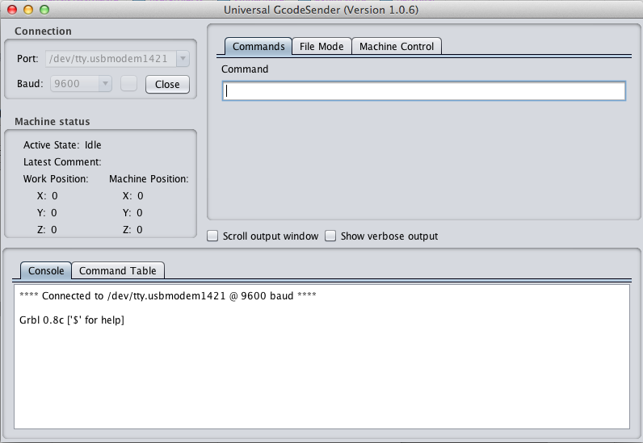
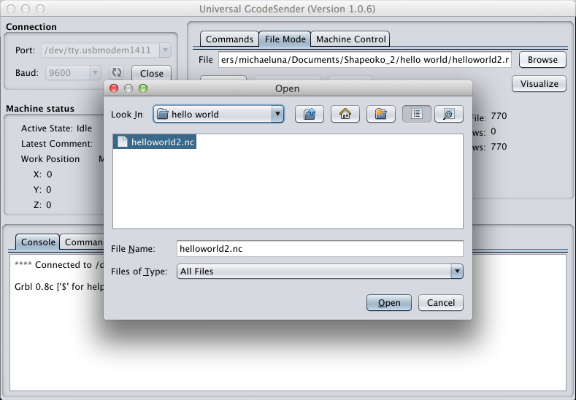
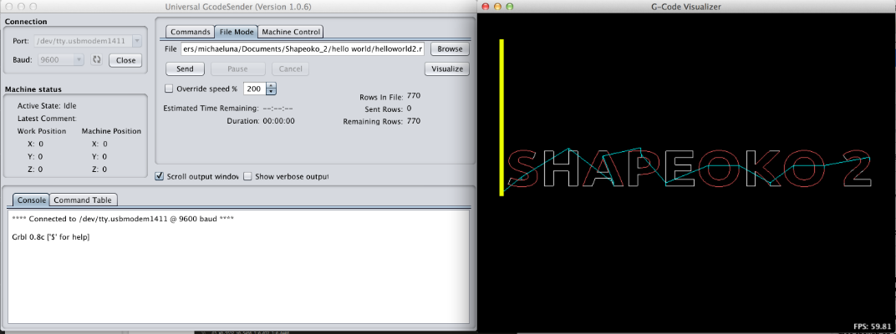
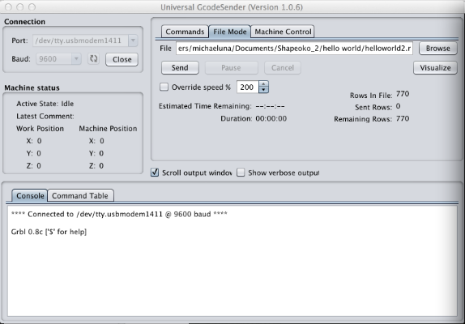
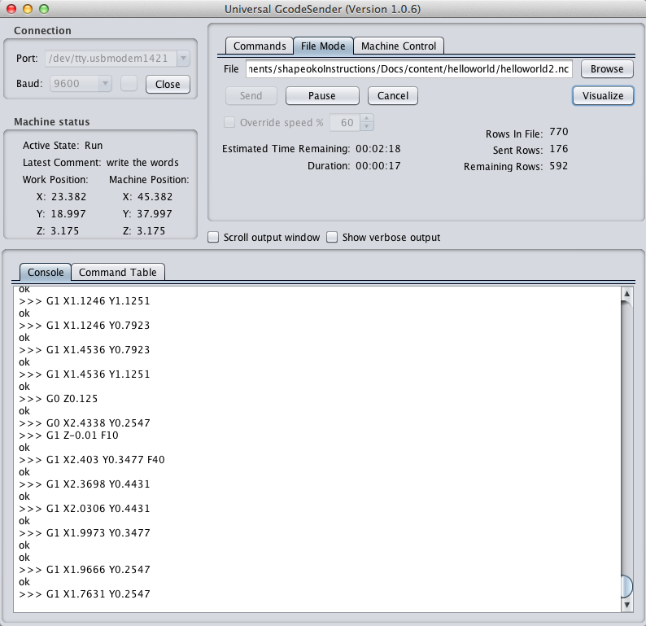
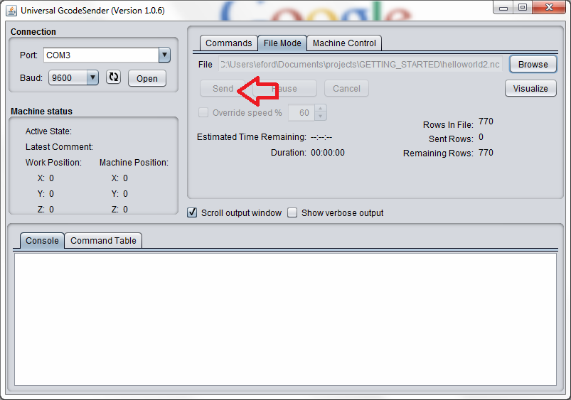

##Getting Set Up

At this point, we should have a fully assembled machine, capable of making amazing things. BUT, first, we need make sure everything is in good working order.  To achieve that, we're going to run a job, that we in the ShapeOko community call "Hello, World". When it's finished, it will look like this:

Before we begin, let's make sure we are ready to go:

1. Electronics tested? (You may wish to return to the [electronics page](electronics.html) and verify your wiring)
2. Machine Assembled?
3. Software Installed?
4. Work area cleaned up?

If you answered yes to all 4 questions above, then let's proceed.

##Operating Checklist

Always review and follow the [operating checklist](http://www.shapeoko.com/wiki/index.php/Operating_Checklist). While hearing protection isn't necessary for this plotting operation, one should still get in the habit of wearing safety glasses.

##Work Area

Tape a piece of paper down to your work area. The paper should be taped in landscape orientation (wider than it is tall). Keep the paper towards the front/left of the machine.

##Download Files

Download [this file](http://docs.shapeoko.com/content/helloworld/helloworld2.nc) (you could right-click or control-click on the link to bring up a menu to force the saving) and save it somewhere to your computer that you will remember, e.g., the Desktop or your Documents folder. 

Please note that it is in imperial, and will leave your machine in inch mode. Use the command G21 to switch back to metric if accustomed to using that system when jogging the machine. It also has different begin/end points for the paths than the original file, but the problems which those exposed are addressed by the Y-axis dual motor.

##Position Machine

With the machine turned off, move your gantry to the front left corner of the paper that we taped down in step \#1.

##Attach Sharpie

Using a piece of tape, affix your sharpie to the z-axis spindle carriage assembly. (Optionally you can mount the pen in-between two blocks of material which have matching grooves on them --- see the hello world at the top of this page. Forum user Claudio used shorter bolts to attach the spindle straps, then used rubber bands to attach the pen to them. Other users have used criss-crossed Zip ties. The better secured the pen is, the better the plot will look.)

##Position Sharpie

Lower your sharpie so it is about 1 inch above the paper (remember that the previous running of this file left the machine in inch mode --- if accustomed to using metric to jog the machine issue G21 to switch back).

##Open Software

Plug the power in to your machine and open Universal Gcode Sender on your computer. Once the program has loaded, plug in the USB cord to your computer and you should hear the stepper motors engage.

##Open Connection Between Computer and Machine

Select the correct com port and baud rate from the drop down menus on the left.  Click 'Open' to establish a connection with the Arduino.  Once the connection has been made, GRBL will say hello by displaying its version number.

##Verify Grbl Settings

In the command line at the top of Universal Gcode Sender, type $ and press enter.  Grbl should respond with a help message.

In the same command line, type $$ to view the current Grbl settings.

##Configure Grbl Settings

The default values need to be changed in order for your machine to function properly.  To do this, simply enter the correct value for each setting into the command line and press enter.  For example, to change the x-axis steps/mm to 40.020 you would type this, followed by an enter:

		$0=40.020

These are the correct Grbl settings for the stock full kit machine.

**Note: Previously, the above image showed the Z-axis set to $5=2500, this has been set back to the original 500 --- if your machine doesn't move reliably you may wish to try further reducing it to 250. Once your machine is assembled and working, you can fine tune it per the instructions on the wiki.**

If you have sourced your own electronics, you can easily determine your own settings by using this [Grbl settings calculator.](http://homepage.ntlworld.com/r.j.noble/ShapeOko/grblcalc/)

Ensure that the machine moves the correct distance/direction for each axis. Revisit the [electronics page](electronics.html) if need be to re-wire the machine, or [re-configure Grbl](http://www.shapeoko.com/wiki/index.php/Grbl#Invert_Bits) (while a reversal of the X- and Y-axes will merely result in mirrored or upside-down prints (once one gets the origin set), a reversal of the Z-axis can be disastrous, resulting in a crash into the wasteboard).

If one has started with the suggested value of

		$6=28
		
Then if the Z-axis is reversed you should enter

		$6=156
		
If the X-axis is reversed you should enter

		$6=60
		
If the Y-axis is reversed you should enter

		$6=92
		
If X- and Y-axes are reversed

		$6=124
		
If X- and Z-axes are reversed

		$6=188
		
If Y- and Z-axes are reversed

		$6=220
		
And lastly, to reverse all three axes

		$6=252

##Open File

Browse for the file you downloaded in step #1 and open it.

##Verify File

Click the visualize button, located just below the browse button, to see what the file will look like. A screen similar to the one below will display after a few seconds. You can interact with this screen by left clicking and dragging your mouse around. The depth of this file is very shallow (.01"), so there is not much to look at beyond the general shape of the output. If the file were deeper, those levels would be represented as layers in the visualizer.

##Pre-Flight

If your file visualization looks correct, close the visualizer and click the 'machine control' tab towards the top of the window.

##Set Zero Position

Click the 'Reset Zero' Button, to tell your machine that you are at 0,0. You should notice on the left of the panel your work position coordinates will be set to X:0, Y:0, Z:0

##Air Print

To make sure there are no mistakes, lets draw some stuff in the air.  Click the 'File Mode' tab at the top of the program window. With the sharpie ~1" above the work surface, click the 'Send' button just below the file path.

You should see Universal Gcode Sender start streaming the text file line by line to the Arduino, and your machine should start moving around.

##Run Job!

Lower your sharpie so it is *just* barely above the paper.

OK, now we're ready. Take a deep breath (this is going to be amazing) and click the 'Send' button just below the file path one more time.

##Rule World!

Your machine will now run the hello world job. Keep close to your computer, and be aware of how to quickly disconnect the power from your machine in case of an emergency situation.

Once it's complete, you may wish to [document it on the wiki](http://www.shapeoko.com/wiki/index.php/Hello_World).

If you have any difficulties see [Assembly Troubleshooting on the wiki](www.shapeoko.com/wiki/index.php/Assembly_troubleshooting). See also [Fine Tuning](www.shapeoko.com/wiki/index.php/Tuning) and [Operation Troubleshooting](http://www.shapeoko.com/wiki/index.php/Operation_Troubleshooting).

###Next Step [First job](http://docs.shapeoko.com/firstjob.html)

To express concerns, post on the [forums](http://www.shapeoko.com/forum/index.php), to suggest improvements without using github, edit [this wiki page](http://www.shapeoko.com/wiki/index.php?title=Helloworld_1&action=edit&redlink=1).
