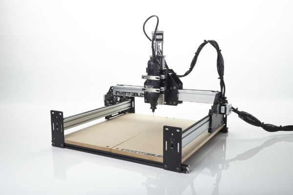
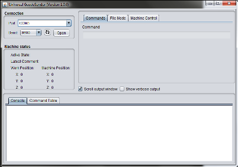
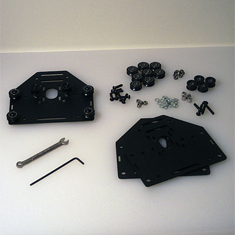
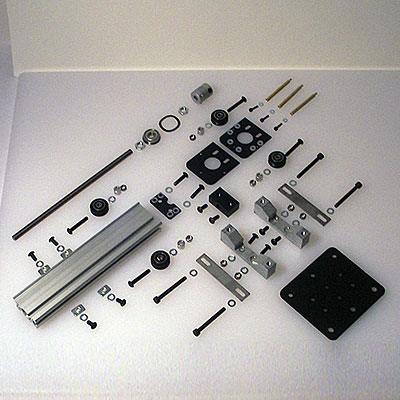
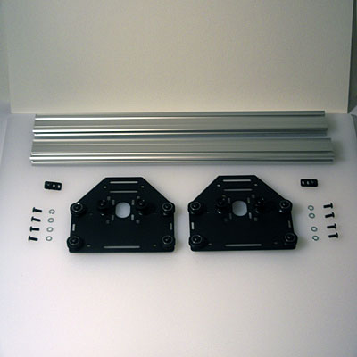
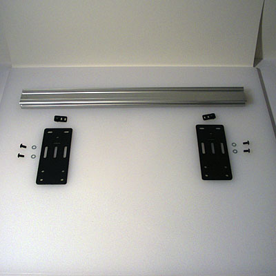
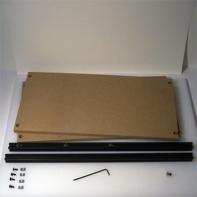

#Assembly Overview

##Welcome!

Thank you for supporting Project Shapeoko, an opensource CNC machine which may be used for milling, lasercutting, 3D printing, cutting fabric, &c. The work area is approximately 12" x 12" x 3.5" and precision is dependent upon the belts, pulleys, motors and electronics which are selected (for the default SO2, that is 1/40th of a mm along X and Y, 1/320th of a mm along Z ([ShapeOko 2 Grbl Configuration page](http://www.shapeoko.com/wiki/index.php/Grbl_Configuration)). ShapeOko is named after the **Shape**ways 3D printing and the Pon**oko** laser cutting services and was initially launched on [Kickstarter](http://www.kickstarter.com/projects/edwardrford/project-shapeoko-a-300-complete-cnc-machine?ref=live).

The following pages are filled with the information you need to assemble your Shapeoko 2 desktop CNC machine. Please read through them in advance, and make note of things to check and verify before beginning assembly. If you have any difficulties with assembly, please check the ShapeOko [wiki](http://www.shapeoko.com/wiki) and [forums](http://www.shapeoko.com/forum/index.php).

###Overview

1. Review the parts in your kit
2. Read the [Pro Tips](tips.html) and make sure you have all the required [Tools](tips.html#Tools) 
3. Install your [software](software.html)
4. Test Your [Electronics](electronics.html)
5. Review the [wiring options](wiring.html)
6. Assemble your machine (see the side bar for assemblies)
7. Run [Hello, World!](helloworld.html)
8. Run your [First Job!](firstjob.html)

###Contributing

If you are interested in contributing to the docs pages, please see [this page](contribute.html) for information on how to get started.

##Assembly Steps

The first thing to do is to compare what you have received w/ the inventory sheet included w/ your kit. For reference, there is also a b.o.m. (bill of materials) in the initial announcement [Shapeoko 2 Now Available For Pre-order!](http://blog.inventables.com/2013/10/shapeoko-2-now-available-for-preorder.html). If anything in your kit is missing or damaged, contact [Inventables Customer Service](https://www.inventables.com/about): [help@inventables.com](mailto:help@inventables.com).

##Software
[Goto the Instructions](software.html)

Before we can control our machine, we need to install and/or configure some software. If you're going to test your electronics, then you'll need to have this step done before you can complete that step. Otherwise, you'll need to complete this step before running Hello, World. 

---

##Electronics
[Goto the Instructions](electronics.html)

In this step, we will *test* our electronics setup. It's beneficial to do this prior to assembling the machine, as some issues are more easily addressed before assembly takes place. If a problem were to occur, it's much easier to troubleshoot without having to disassemble the machine!

---

##V-Wheels and Idlers
[Goto the Instructions](wheels.html)

A lot of the "work" required to assemble the machine is done in this step. It's not hard work, but it'll take a while. Just like long division.

---

##Carriages
[Goto the Instructions](carriages.html)

This is the most labor intensive part of the assembly. You will be assembling 3 motor mount plates.

---

##Z-Axis
[Goto the Instructions](zaxis.html)

The z-axis is comprised of 3 separate assemblies, and will require some time (and patience) to fully assemble. Once you are done with this step, your machine will really start to take shape. 

---

##Gantry
[Goto the Instructions](gantry.html)

The gantry continues the process of taking assemblies and combining them.

---

##Y-Axis
[Goto the Instructions](yaxis.html)

The Y-axis makes up the frame of the machine along with the last component in the next step.

---

##Work Area##
[Goto the Instructions](workarea.html)

The work area integrates the last component with the previous assemblies, completing the mechanicals of the machine.

---

##Electrical Wiring##
[Goto the Instructions](wiring.html)

The machine is complete when the electronics are wired up to the motors, allowing movement.

---

##Hello, World
[Goto the Instructions](helloworld.html)

Your very first run! 

---

##First Job
[Goto the Instructions](firstjob.html)

A basic introduction to using the machine for milling.

