## Option #3 
This is the 'mount the controller on the machine' method. It's experimental, it's untested, it's **hot**. *You can assemble the entire machine before doing this step*. If you venture down this path, you're an explorer, and may be on your own. It might be worth it.

###assembly tip
_While it's physically possible to attach the Arduino after the machine is assembled, it's a pain in the ass. If you want to do yourself a favor, and save some frustration. Wire the entire gantry before mounting it to the work area._

_Note: in all the pictures shown below, yellow zip ties are used. These were chosen for documentation because they are more visible than the black zip ties included with your kit._

###You will need the following to complete this option

* Zip Ties
* Expandable Braiding (2 sizes)
* Razor Blade (wire strippers)
* Bravery & Courage

###X and Z wiring 
Looking at the machine from the back, the idea is to pull down the wires from the Z-axis stepper motor to the x-axis carriage. Then pull up the x-axis stepper motor wires to the top of the carriage, so you can zip tie them together using the zip ties. 

####Expandable Braiding
The included expandable braiding can be used in this step as well. The best way to thread the wires through the braiding is to twist them together, forming two 'groups', like so:

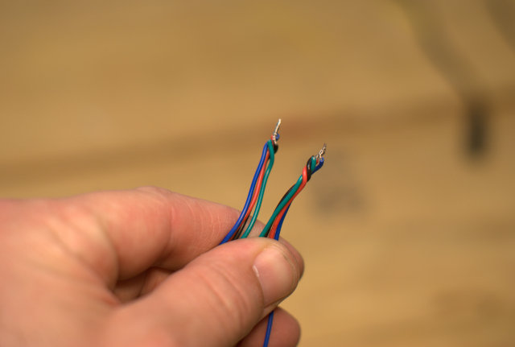

And then you can start threading both groups (simultaneously) through the expandable braiding. This isn't hard, but takes a little time if you've never done it before. 

####Routing Wires

After the wires are pulled through the braiding, continue pulling until both wires are tight. They will be uneven lengths (because the z-axis is further away!).

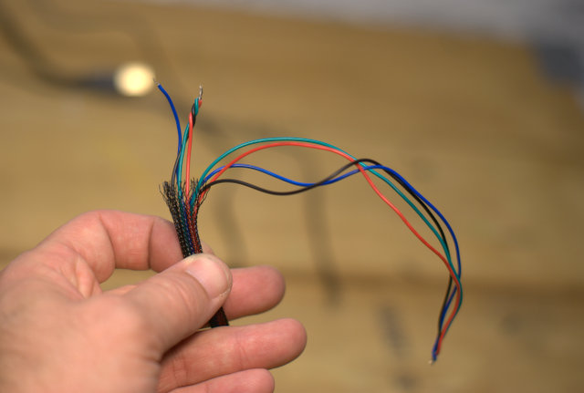

Be sure you have approximately 5 inches of wire for the X-axis. We are going to route that **around* the stepper motor, so we'll need a longer length to make it to the controller.

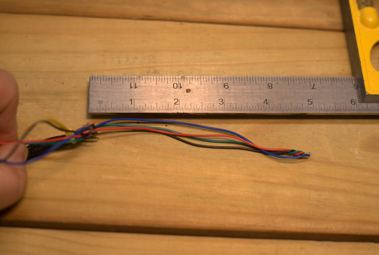

Once you do, put a zip tie on the end of the braiding to keep it from fraying and to keep it from sliding back down. 

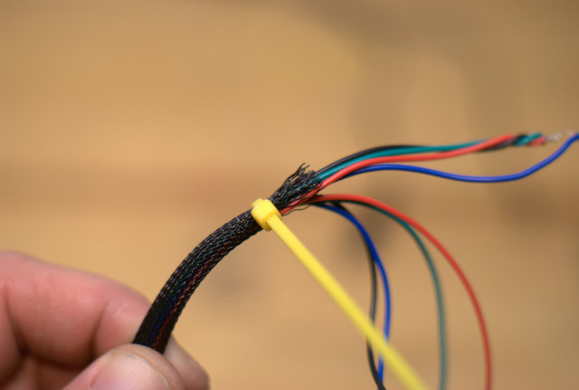

Then, zip tie that to the side motor mount

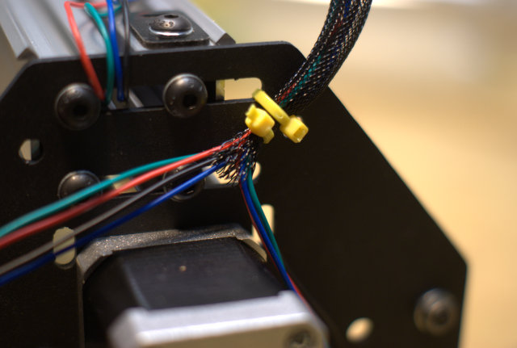

Now that the bundle has been tied to the motor mount plate, go ahead and route the wires around the stepper motor as shown below. 

;

Once that is finished, you are done (for now) with the X and Z stepper motor wires. Just move those out of the way. Now it's time to wire up the Y-axis!

###Y Axis

Here is an overview of how the Y-axis wires are routed. From the front, you can see the second Y stepper motor (the one on the left side of the machine) has it's wires routed through the MakerSlide. 

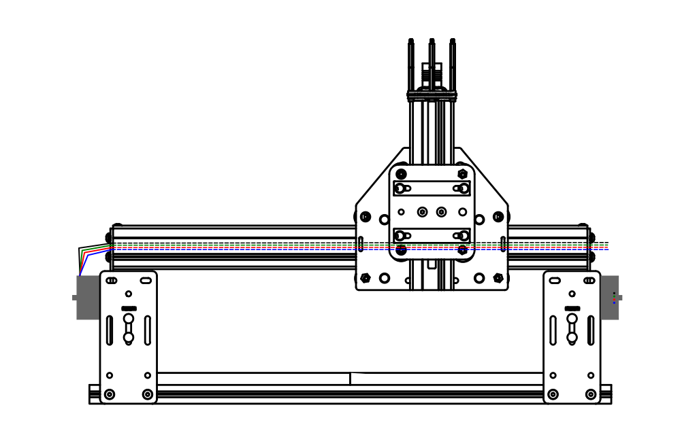;

It's easiest if you slide the gantry all the way towards the left side. Then twist the wires together (like we did to get them through the expandable braiding earlier), then thread the wires through the horizontal slot on the carriage plates. Like this:

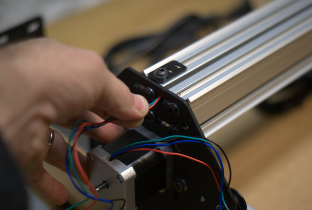

Once you have pushed the wires past the gantry, grab the bundle and pull it out from between the pieces of MakerSlide. It's easier to do this than try to thread it all the way across.

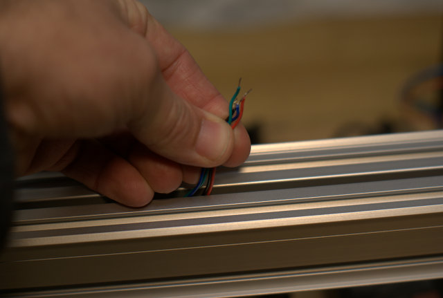

At the opposite side of what you started, thread the wires through the carriage plate's top slot. Like this

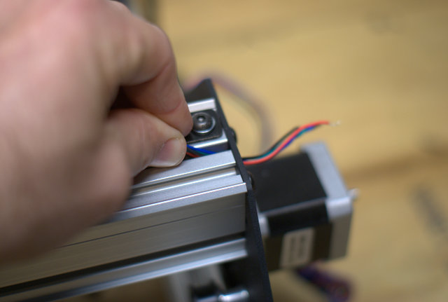

Now pull the wires so they are fairly taught on the other side. Be careful not to pull too hard!

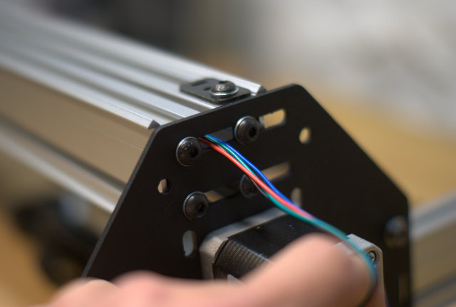
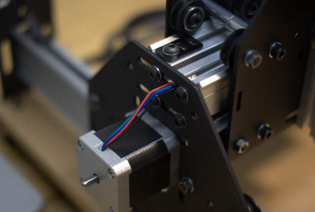

Both sets of wires for the Y axis should be on the same side of the machine now. That's awesome. This part is going to get pretty hairy. The wires coming from the Y axis stepper motor that's on the same side as the controller, are **REALLY** long. I don't advocate cutting these wires. You never know what you might want to do to your machine at some point in the future, and cutting the wires might limit your options. Instead, let's manage the wires the best we can, and then wrap them up together and tuck them away. 

First step is to pull your leads so they're not so curly. The motors ship in a styrofoam box and their leads are all wound up to conserve shipping space. Do yourself a favor and smooth those wires out. Otherwise they're going to be curling up and getting all twisted around things. Seriously. Smooth them out.

**Now that that's done, let's move on.**

Tie your pairs together, like the image below. (black -> green, green -> black, red -> red, blue -> blue). It will be easier (and more secure) if you strip off a few more **mm** of coating before twisting them together.  

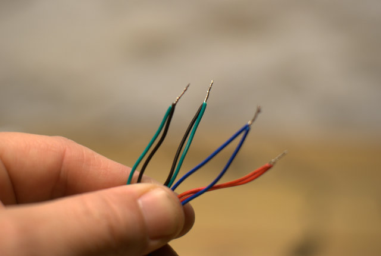

Let's go ahead and wire the motors to our controller now

####Z-Axis

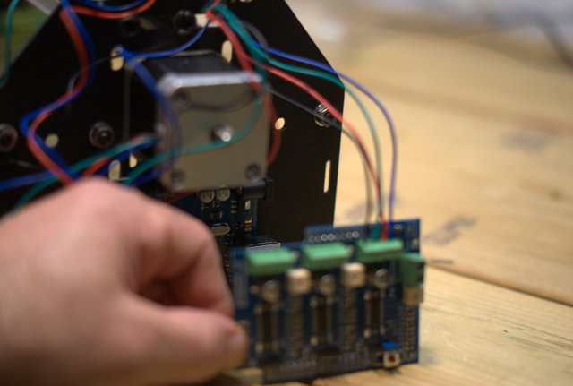

####X-Axis

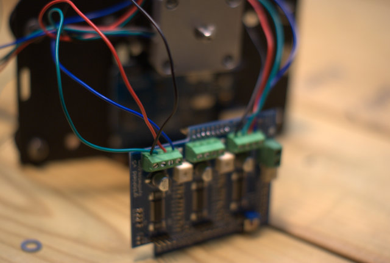

####Y-Axis

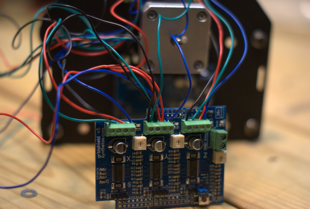

Now, everything should be connected to your gShield, so it's time to attach the gShield to the Arduino. Take your time and make sure you have all the pins lined up.

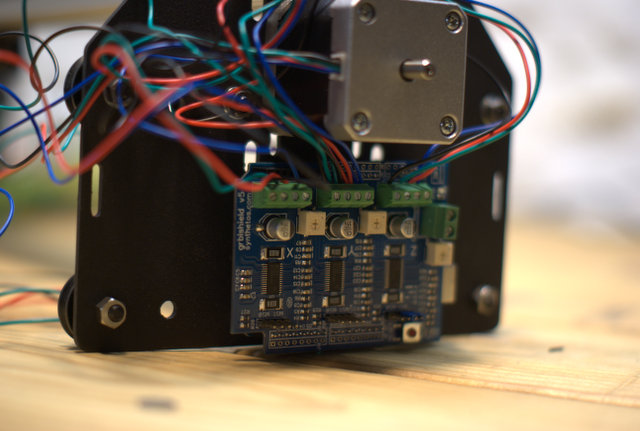

Once that's connected, you'll find yourself with a **RAT'S NEST** of wires. It's time to get those under control. 

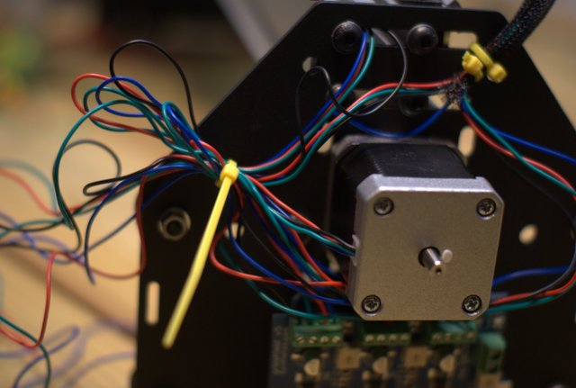

Pull the extra wire out, and zip tie the base of it together

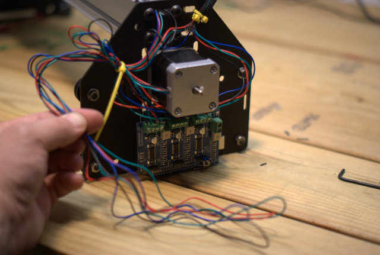

Pull more out, folder it over itself and zip tie it again

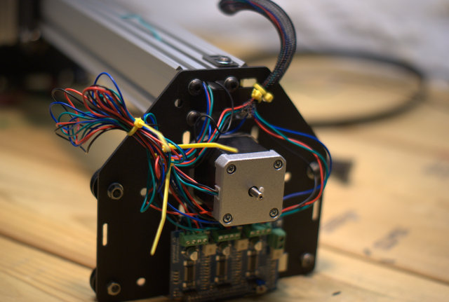

Cover the bundle with expandable braiding, adding a zip tie to the bottom, and top. Then tie the whole thing to the plate like in the picture shown below.

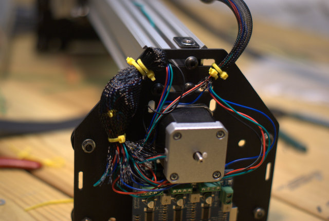

If it's done right, you'll end up with something like this. 

###Next Step [Hello, World](http://docs.shapeoko.com/helloworld.html)
