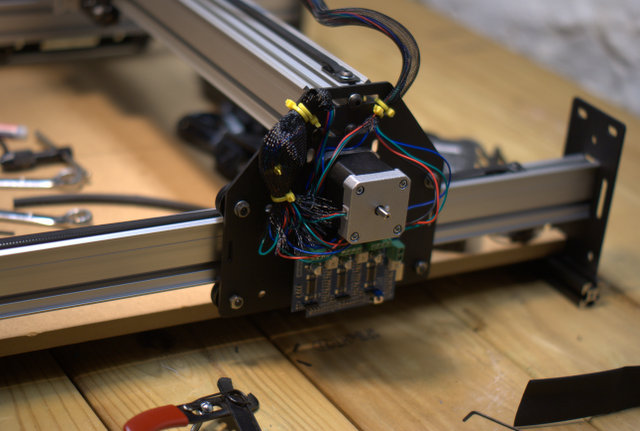
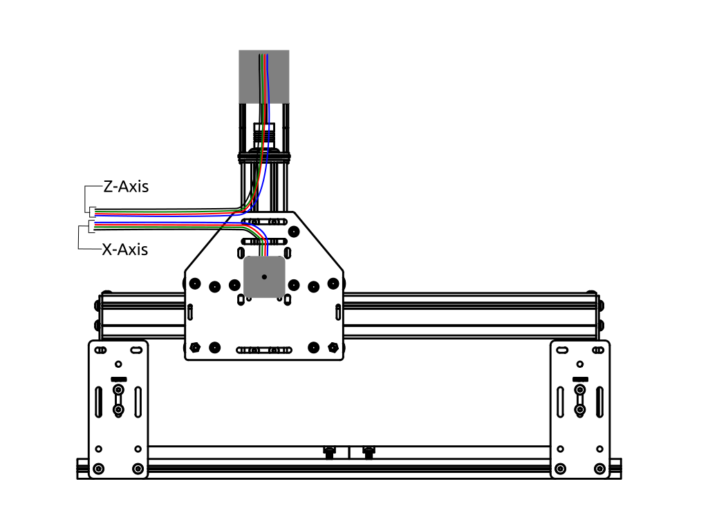
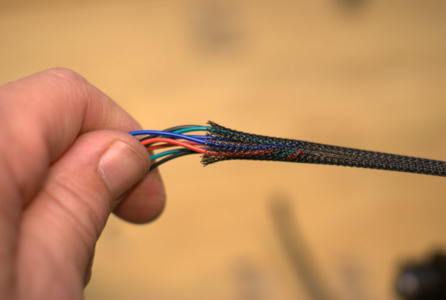
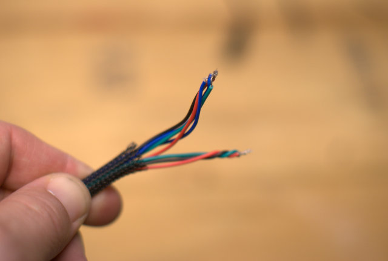
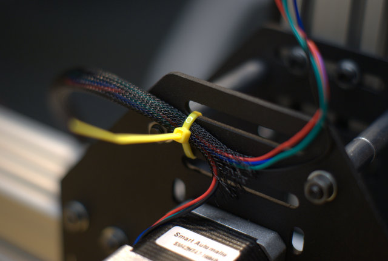

## Option #3 
This is the 'mount the controller on the machine' method. It's experimental, it's untested, it's **hot**. You can assemble the entire machine before doing this step. If you venture down this path, you're an explorer, and may be on your own. It might be worth it.

_note: in all the pictures shown below, yellow zip ties are used. these are preferred for documentation because they are more visible than the black zip ties included with your kit_

###You will need the following to complete this option

* Zip Ties
* Expandable Braiding (2 sizes)
* Razor Blade (wire strippers)
* Bravery & Courage

###X and Z wiring 
Looking at the machine from the back, the idea is to pull down the wires from the Z-axis stepper motor to the x-axis carraige. Then pull up the x-axis stepper motor wires to the top of the carriage, so you can zip tie them together using the included zip ties. 

;

The included expandable braiding can be used in this step as well. The best way to thread the wires through the braiding is to twist them together, forming two 'groups', like so:

And then you can start threading both groups (simultaneously) through the expandable braiding. This isn't hard, but takes a little time if you've never done it before. 

 

After the wires are pulled through the braiding, continue pulling until both wires are tight. They will be uneven lengths (because the z-axis is further away!).

Be sure you have approximately 5 inches of wire for the x-axis. We are going to route that **around* the stepper motor, so we'll need a longer length to make it to the controller.

Once you do, put a zip tie on the end of the braiding to keep it from fraying and to keep it from sliding back down. 

Then, zip tie that, to the side motor mount

Now that the bundle has been zied to the motor mount plate, go ahead and route the wires around the stepper motor as shown below.

;

Great! We are done (for now) with the X and Z stepper motor wires. Just move those out of the way. Now it's time to wire up the Y axis!

If it's done right, you'll end up with something like this. 

