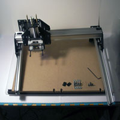
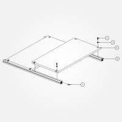
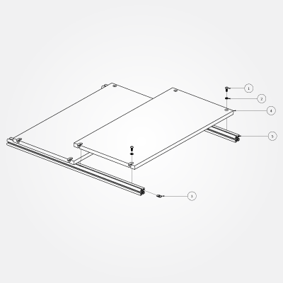

# Work Area

## Overview

##Waste Board Assembly (PS20024)

- 8 25286-02 M5 x 12mm, BHCS
- 8 25287-02 Flat Washer, M5
- 8 26016-01 M5 insertion nut
- 2 PS20001 MDF wasteboard (1/2")
- 2 PS20009 20mm x 20mm x 550mm aluminum extrusion, black anodized

   

## 20x20 Extrusions

Slide Entire  Assembly over wasteboard Assembly, fasten with:

- M5x10
- M5 washer
- Insertion Nut

## Assemble the Frame

Square up the wasteboard assembly carefully, since it will be the foundation for the balance of the machine.

###Parts

* 2 Y-Axis Rail Assembly (PS20026)
* Complete Gantry (PS20025)
* Waste Board Assembly (PS20024)

Turn the eccentric nuts on the V-wheels on the Complete Gantry (PS20025) so that they are as far from the static V-wheels as is possible. Drive the Complete Gantry onto the two Y-Axis Rail Assemblies (PS20026), then attach the open end plates.

Place the 10mm M5 bolts w/ washers into the bottom holes on the open end plates, thread on the insertion nuts, then carefully slide the rail assemblies onto the wasteboard extrusion. Check the alignment with a known-to-be-good square. One can also measure the diagonals to test for squareness. Ensure that everything is aligned squarely and that the Complete Gantry and the X-Axis Sub Gantry move smoothly. Tighten the bolts.

Congratulations! You've built a ShapeOko!

## Squaring the Table

At this point, you will need to adjust the machine's V-wheels. These should be tight enough to hold things in alignment, but loose enough that the machine moves freely and smoothly. The suggested technique for this is, "Loosen the eccentric spacer until the V-wheel does not rotate when the carriage is moving and then tighten just (and no more!) until the v-wheel rotates when moving the carriage. Overtightening will lead to the V-wheel wearing out."

* Slide the gantry back and fourth a couple of times to even out the rails and get everything roughly lined up. It may still feel stiff when sliding, but you can adjust that later.
* Slide the gantry to the back of the machine. Both V-wheels should be touching or at least be the same distance from the belt anchors. Carefully snug up the four screws on the back end plates.
* Gently slide the gantry to the front of the machine. Both V-wheels should be touching or at least be the same distance from the belt anchors. Carefully snug up the four screws on the front end plates.
* Slide the gantry back and fourth a couple times to see if anything is askew. **Note:** It may be tough to move your gantry, almost like it is binding, this is fine as you'll adjust that in the next set of steps. 

###Steps for Silky Smooth Motion

1. Make certain that the four V-Wheels that are mounted with the eccentric nuts are loose. You should notice some slight play once loosened.
2. Slide the gantry back and fourth. It should feel as if it is gliding freely and smoothly. Remember how this feels as this is what we are striving to reach.
3. Taking one V-Wheel at a time, adjust the eccentric spacer and fully tighten it. Slide the gantry back and fourth, is it still how it felt from step 2? If yes, then move on to step 4. If no, then repeat this step until you achieve smooth, gliding motion.
4. Repeat step 3 until all V-Wheels are properly adjusted. 

## Mount the Belts

You should now mount the belts on the belt anchors.

* Divide the belt into thirds (one-third for the X-axis, two equal lengths for the two sides of the Y-axis)
* Loop the belts into the belt anchors
* Tighten one end of each belt
* Use some technique which allows you to tension the other end of each belt and tighten it down. (One method is to tie a length of cord around the open end plate and the Allen key while the latter is inserted into the belt anchor bolt, add a block of wood or plastic as a fulcrum near the top of the Allen key, tie a screwdriver or other tool into the cord's knot, twist the tool in the knot while holding down on the Allen key, then tighten the belt anchor bolt.)

You will also need to complete the wiring as documented in the next step.

