# Z-Axis Assembly

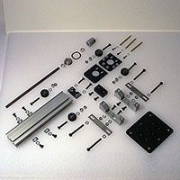

The Z-axis assembly is comprised of several sub-assemblies. When assembling it, it is best to select a Motor Mount Carriage (PS20022) which already has a stepper motor in place.

**Note:** You will need to have at least your Z-axis MakerSlide tapped before completing this step. It is probably best to begin tapping well in advance of needing parts, so as to ensure that one works slowly, carefully and patiently at tapping, especially if one initially lacks experience at it.

##Z Assembly Carriage (PS20021)

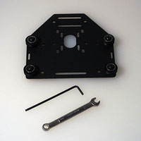

###Requirements

####Parts

1. 26029-01 **Motor Mount Plate** (12ga)
- 30158-01 **Eccentric Nut** x 2 pcs.
- 25203-02 **Dual Bearing V-Wheel (assembly)** x 4 pcs.
- PS20004 **M5 x 20mm BHCS** x 4 pcs.
- 25287-02 **M5 Flat Washer** x 6 pcs.
- 25284-02 **M5 Hex Nut** x 2 pcs.

This is the plate the Z-axis will attach to (it is identical to the Motor Mount Carriage (PS20022) assembled in the previous step, but without smooth idlers. It sits on the front of the gantry and will be connected to the X-axis motor mount plate via rigid aluminum spacers. We will build the plate first, and then attach the two together.

 - Connect V-Wheels (**\#3**) to the plate (**\#1**)
	- two static at the top (using M5 x 20mm BHCS (**\#4**), a pair of M5 Flat washers (**\#5**), and M5 Hex Nuts (**\#6**))
	- two eccentric at the bottom in the larger holes (using M5 x 20mm BHCS (**\#4**), a pair of M5 Flat washers (**\#5**), and using Eccentric Nuts (**\#2**))

##Spindle Carriage Assembly (PS20029)

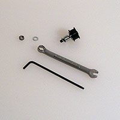

###Requirements

####Parts

1. 30287-01 **Spindle Mount Plate** (12ga) x 1 pcs.
- PS20010 13mm x 35mm x 20mm **Delrin Lead Nut** x 1 pcs. --- check that the threaded rod fits (see below)
- 25287-02 **M5 Flat Washer** x 10 pcs.
- 25284-02 **M5 Hex Nut** x 6 pcs.
- PS20012 **Universal Spindle Mount** x 2 pcs.
- 30158-01 **Eccentric Nut** x 2 pcs.
- 25203-02 **Dual Bearing V-Wheel (assembly)** x 4 pcs.
- 25196-01 5mm x 16mm x 5mm Bearing (x 8 pcs. *contained in #7. above*)
- 25201-01 Precision 1mm spacer (x 4 pcs. *contained in #7. above*)
- 25312-14 3/8" x 5/16" x #12 bore, **Aluminum Spacer** x 4 pcs.
- 25286-05 **M5 x 30mm, BHCS** x 4 pcs.
- 25286-02 **M5 x 12mm, BHCS** x 6 pcs.
- PS20013 **Universal Spindle Mount strap** x 2 pcs.
- PS20005 **M5 x 45mm, SHCS** x 4 pcs.

There is a dynamic version (~15MB) of the above diagram at: [PS20029.svg --- Spindle Carriage Assembly](content/tPictures/PS20029-100.svg).

1. Take the Spindle Mount Plate (**\#1**) and orient it so the large holes are to the right.
2. Using an M5 x 30mm BHCS (**\#11**), attach a V-wheel (**\#7**) to the left top corner hole, using an aluminum spacer (**\#10**) to set it off from the plate, fastening it from the other side using an M5 Flat Washer (**\#3**) and an M5 Hex Nut (**\#4**)
3. Repeat the above step w/ another V-wheel for the bottom left corner hole
4. Using an M5 x 30mm BHCS (**\#11**), attach a V-wheel (**\#7**) to the right top corner hole, using an aluminum spacer (**\#10**) to set it off from the plate, fastening it from the other side using an Eccentric Nut (**\#6**)
5. Repeat the above step w/ another V-wheel for the bottom right corner hole
6. Attach the Delrin Lead nut to the center of the plate using two 12mm M5 BHCS (**\#12**) --- be careful not to over-tighten the bolts --- they should be tightened after the plate is mounted onto the balance of the Z-axis
7. Using four 12mm M5 BHCS (**\#12**) fasten the Universal Spindle Mounts (**\#5**) to the top and bottom of the plate with an M5 Flat Washer (**\#3**) and a M5 Hex Nut (**\#4**) 
8. Using four M5 x 45mm, SHCS (**\#14**) and four M5 Flat Washers, fasten a Universal Spindle Mount strap (**\#13**) to each universal spindle mount.

**Note:** Be certain to use the aluminum spacers (**\#10**) which set this plate off from the Z-axis rail assembly, allowing room for the threaded rod) and ensure that all V-wheels are vertically aligned with each other (be careful of washer placement/order). Remember to turn the eccentric nuts so as to move the V-wheels towards the outside of the carriage plate, making room for them to fit onto the MakerSlide.

##Z-Axis Rail Assembly (PS20028)

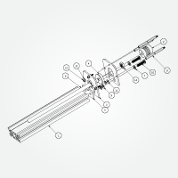
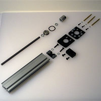
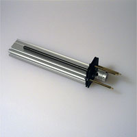

One should also attach the motor for the Z-axis at this time.

###Requirements

####Parts

1. 25142-07 Z Axis **Rail MakerSlide Extrusion 200mm** x 1 pcs. (Please note that one end must have both holes tapped w/ M5x0.8 threads)
- 25772-02 Z-Axis **Flexible Coupler 5mm--8mm bore** x 1 pcs.
- 30288-01 **Z-Axis Motor Mount Plate** (12ga) x 2 pcs.
- 30169-01 8x22x7mm **flanged bearing** x 1 pcs.
- 30289-01 **Z-Axis Shim Plate** (12ga) x 1 pcs.
- PS20011 **M8 Threaded Rod Stainless Steel, 200mm** x 1 pcs.
- 25287-02 **M5 Flat Washer** x 2 pcs.
- PS20014 **Brass Standoff spacer** M3 male x M3 female 50mm x 3 pcs.
- PS20016 5mm x 10mm x 1mm thick, **Nylon Spacer** x 4 pcs. (these are used for the M5 BHCS (#10. below) which hold the Z-Axis Motor Mount Plate to the MakerSlide)
- PS20004 **M5 x 20mm BHCS** x 2 pcs.
- PS20015 3mm x 8mm x 1mm thick, **Nylon Spacer** x 6 pcs. (these are used with the M3 SHCS (#12. below) which attach to the Brass Standoff spacers)
- 25285-10 **M3 x 12mm, SHCS** x 3 pcs.
- 25287-03 **M3 Flat Washer** x 3 pcs. 
- PS20007 **M8, Hex Nut** x 2 pcs.
- PS20017 **Wave Disc Spring**, .901"ID, 1.159" OD, .013" thickness

####Electronics

- **Stepper Motor** (it is all-but impossible to attach the motor after the fact without disassembly)
- 25287-03 **M3 Flat Washer** x 3 (or more, see below) pcs.

####Tools

 - 13mm (or 1/2") open end wrenches x 2 pcs.
 - M3 Hex Key (for the M5 BHCS)
 - M2.5 Hex Key (for the M3 SHCS and coupler set screws)
 - 5mm open end wrench, adjustable crescent wrench or pliers (ideally nylon-jaw parallel) to tighten the M3 brass standoffs

**Note:** Depending on how deeply tapped on the stepper motor and how long the threads are on the brass standoffs, it may be necessary to add additional M3 washers when attaching the motor using the brass standoffs.

**Note:** Check your rod's straightness (one way is by rolling it on a flat surface) before assembly and check to see that the threaded rod runs smoothly on the Delrin Lead nut --- if it doesn't, run the nut along the rod until it does. Using a drill is one option. Be certain the threads of the nut are free of debris or other materials. It's also a remote possibility that the rod may be out-of-spec rather than the nut --- you may want to consider taking the nut to a local hardware store and trying it on their stock of M8 all-thread to see if it works better on one of them.

The Z-Axis Rail Assembly is the most intricate and complex assembly, and requires patience to assemble. One way to do this is to assemble it from the inside out, starting with the smallest pieces as described below. One could of course try top-to-bottom or bottom-to-top --- just follow the diagram and be careful to use equal numbers of spacers/washers for each connector and to not damage or bend the brass stand-offs.

1. Take one Z-Axis Motor Mount Plate (**\#3**, this will become the bottom)
- place M3 washers (**\#13**) onto the 12mm M3 screws (**\#12**) and place them in the appropriate holes
- stack the Nylon Spacers (PS20015) (**\#11**) onto the screws (note that an equal number of spacers is used for each screw, including the M5 bolts which will go into the other plate from the other side in a later step) --- set the beginnings of this sub-sub-assembly aside carefully
- place the Wave Disc Spring (**\#15**) onto the narrow part of the flanged bearing (**\#4**)
- insert that into the second Z-axis Motor Mount Plate (**\#3**)
- insert the two M5 bolts (**\#10**) and M5 washers (**\#7**) from the other side of that plate
- add the last Nylon Spacers (**\#9**) to the end of each bolt (**\#10**) and slide the top and bottom Z-axis Motor Mount Plates together --- carefully set this sub-sub-assembly aside
- Attach the Flexible Coupler (**\#2**) to the stepper motor (the shaft should fall just short of half the length of the coupler)
- Place an M3 Washer (**\#13**) onto a Brass Standoff Spacer (**\#8**) and fasten it to the stepper motor --- if it bottoms out, add another washer and try again --- repeat for the other brass standoffs. Use an equal number of M3 Washers to attach the three Brass Standoff Spacers to the stepper motor --- if a brass standoff doesn't seat as deeply as it should, because the threads aren't well-formed, use a die (or very carefully, a steel nut) to re-thread.  
- Attach the stepper motor and brass standoffs to the sub-sub-assembly from Step \#7 using the M3 SHCS and M3 washers --- make sure not to force anything when tightening the standoffs, remember it's only brass and can snap off inside the motor if you're not careful enough.  The standoffs should need only to be snug, as the screws on the other end prevent the standoffs from rotating. Be careful of the orientation of the sub-sub-assembly, not to lose the M5 bolts and plastic spacers.
- Place the Z-axis Shim Plate (**\#5**) on top of the Z Axis Rail  (**\#1**, 200mm MakerSlide) and attach it using the M5 bolts (as noted above, the Z-axis must have threads for these bolts at this point, cut in by tapping) --- be careful of the orientation of the MakerSlide, the V-rails must be oriented as shown in the diagram so that the Spindle Carriage Assembly (see below) V-wheels will fit.
- After determining the spacing for the Threaded Rod (**\#6**) (see below) thread on one M8 Hex Nut (**\#14**) to the top position on the Threaded Rod
- Slip the Threaded Rod through the Flanged Bearing of the sub-sub-assembly from Step #7 above
- Thread on the second M8 Hex Nut

Review all connectors to make certain that everything is tight --- be careful not to bend the threaded rod or strip any screws. 

####Threaded Rod

[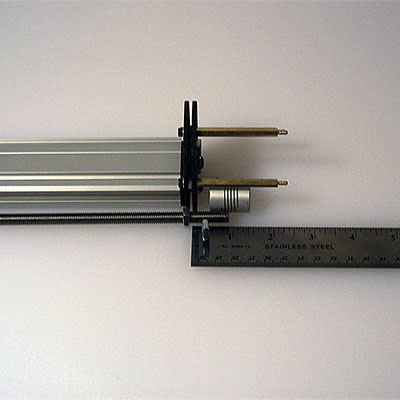](content/tPictures/so_z_axis_dimensions_8.jpg)

Compare the threaded rod (**\#6**) to the assembly, thread on one M8 Hex Nut (**\#14**), threading the latter far enough down to allow room for the flanged bearing, a second hex nut, and for the threaded rod (and the stepper motor shaft) to be just short of half-way into the flexible coupler (**\#2**). Insert the threaded rod into the bearing, add the second M8 hex nut and tighten them with two wrenches, being careful not to bend the rod. Note that the motor shaft should go far enough in to the flexible coupler as to be certain of gripping firmly, and less than half the length of the flexible coupler (the two ends should **not** interfere with each other).

Tighten the coupler set screw holding the threaded rod using the 2.5mm hex key. If the flexible coupler doesn't securely grip the threaded rod, wrap the end of the rod in some sort of metal, foil or tape to ensure coupler holds it securely. Make certain the coupler holds the rod squarely. One inexpensive source for metal shims is aluminum drink cans which are easily cut with appropriate tools (and wearing appropriate safety gear).

**Note** the nuts are commodity / off-the-shelf parts and have a fairly wide manufacturing tolerance. If your threaded rod wobbles unduly after assembly, mark the nuts so as to indicate their orientation and try swapping them around in terms of orientation and positioning, keeping notes on which you have tried --- you should hit upon an arrangement which allows the rod to run fairly true, or at worst case, not hit any other parts (some whipping is inevitable --- one simply wants to achieve a state where nothing will be damaged by the rod end). If nothing works, contact Inventables customer service, or try sourcing new nuts (one option is to take the bearing and threaded rod into a hardware store and try different nuts until you find a pair which works).

####Stepper Motor

As noted above, one should attach the stepper motor during the course of the assembly if at all possible. If not... place M3 washers on the brass M3 standoffs --- if the standoffs bottom out, add sets of M3 washers to ensure the threads are well-engaged and not bottoming out. Ensure that the motor shaft will also fit just short of half-way into the flexible coupler and that the rod and motor shaft have a gap which will allow the flexible coupler to function without interference or binding. Tighten the coupler set screw holding the motor shaft using the 2.5mm hex key.

Tighten everything. If the M3 screws bottom out in the stand-offs, add washers one at a time until everything is secure.

###Z-Axis Sub-Assembly (PS20030)

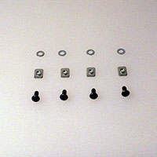
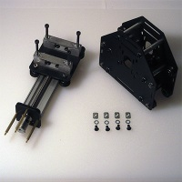

1. PS20021 **Z-Assembly Carriage** x 1 pcs.
- PS20028 **Z-Axis Rail Assembly** x 1 pcs.
- PS20029 **Spindle Carriage Assembly** x 1 pcs.
- 25287-02 **M5 Flat Washer** x 4 pcs.
- 26016-01 **M5 insertion nut** x 4 pcs.
- 25286-01 **M5 x 10mm, BHCS** x 4 pcs.

Insert the 10mm M5 bolts (**\#6**) with an M5 washer (**\#4**) into the Z-Assembly Carriage (**\#1**) from the side the V-wheels are on, thread on the M5 insertion nuts (**\#5**), then slide the MakerSlide of the Z-Axis Rail Assembly  (**\#2**) onto the nuts, align and center the assemblies and tighten.

Turn the eccentric nuts on the Spindle Carriage Assembly (**\#3**) so that they move the matching V-wheels as far as possible from the opposing static V-wheels (think of them as pairs, one movable with an eccentric nut, the other unmoving). Slide the Spindle Carriage Assembly onto the Z-Axis Rail Assembly, match it up with the Delrin Lead nut and turning the threaded rod using the flexible coupler, bring the Spindle Carriage Assembly up so that the V-wheels are completely on the MakerSlide V-rail. Be careful not to nick or damage the Delrin V-wheels, or to cross-thread the Delrin Lead nut. 

If necessary, loosen the bolts holding the Delrin Lead Nut and adjust it to hold the threaded rod as straight as is possible, testing to see how the M8 threaded rod turns.

Carefully adjust the eccentric nuts so that the MakerSlide is held in place firmly, but not so tight as to damage the Delrin V-wheels --- they should turn when one rotates the coupler/threaded rod, moving the spindle carriage assembly up or down.

##Sub Gantry (PS20031)

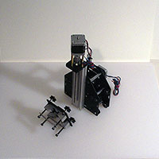

###Requirements

####Parts

1. PS20022 **Motor Mount Carriage** x 1 pcs.
2. PS20030 **Z-Axis Sub-Assembly** x 1 pcs.
- PS20002 3/8" x 1-1/4" x #12 bore, **Aluminum Spacer** x 6pcs.
- PS20006 **M5 x 70mm SHCS** x 6 pcs.
- 25287-02 **M5 Flat Washer** x 12 pcs.
- 25312-20 3/8" x 1" #12 Bore, **Aluminum Spacer** x 6 pcs.
- 25284-02 **M5 Hex Nut** x 6 pcs.

If possible, select a Motor Mount Carriage (PS20022) which has a stepper motor attached. If using wiring option #2, there should be a terminal block attached to the right (on the side opposite the V-wheels and smooth idlers).

For each M5 x 70 mm SHCS (**\#4**), add a washer (**\#5**) then place them in the outer holes of the Z-Axis Sub-Assembly (**\#1**) from the side opposite the V-wheels. Then for each M5 bolt (**\#4**), add each pair of spacers (one each of **\#3**, & **\#6**). Add the Motor Mount Carriage, then for each M5 bolt, add an M5 washer, and M5 hex nut (**\#7**). Ensure the sub gantry is square and tighten everything.

[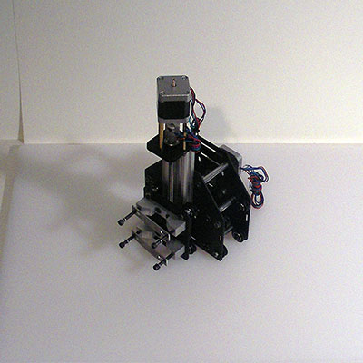](content/tPictures/so_carriage_8.jpg)

###Next Step [Gantry](http://docs.shapeoko.com/gantry.html)

To express concerns, post on the [forums](http://www.shapeoko.com/forum/index.php), to suggest improvements without using github, edit [this wiki page](http://www.shapeoko.com/wiki/index.php?title=Zaxis_2&action=edit&redlink=1).
