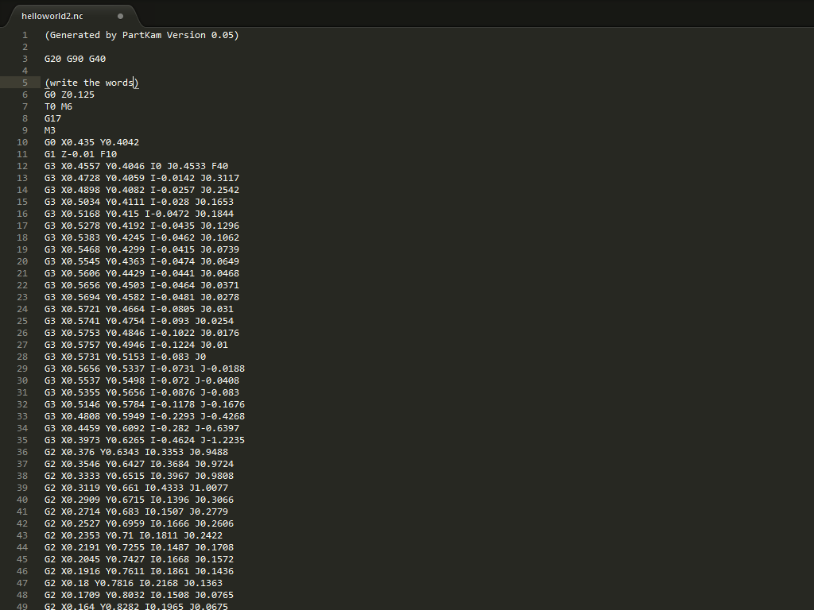
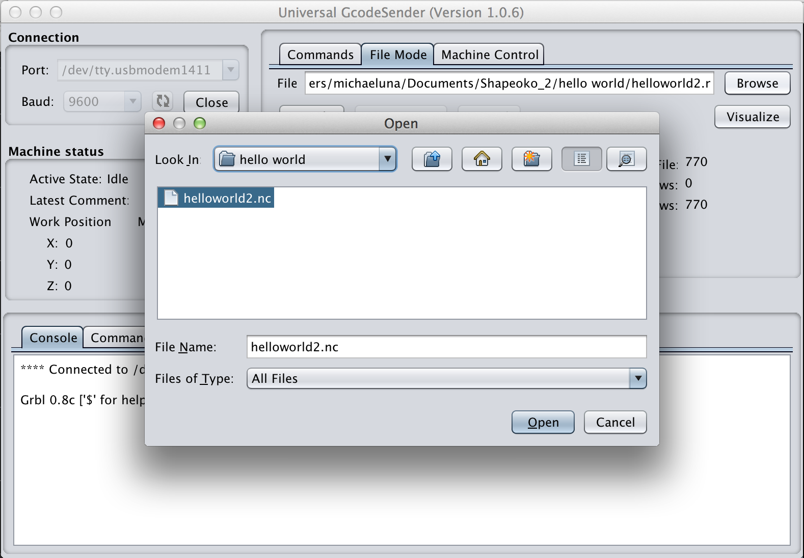
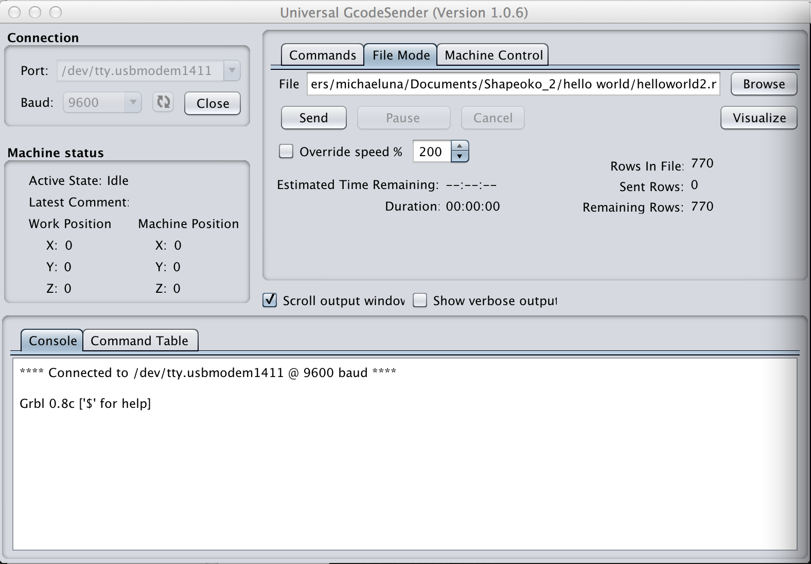
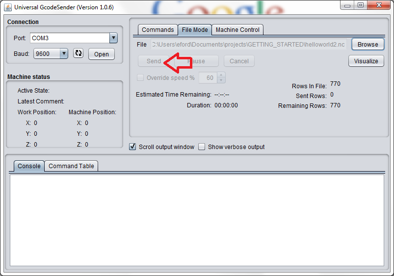

##Getting Set Up

At this point, we should have a fully assembled machine, capable of making amazing things. BUT, first, we need make sure everything is in good working order.  To achieve that, we're going to run a job, that we in the Shapeoko community call "Hello, World". When it's finished, it will look like this:

Before we begin, let's make sure we are ready to go:

1. Electronics tested?
2. Machine Assembled?
3. Software Installed?
4. Work area cleaned up?

If you answered yes to all 4 questions above, then let's proceed.

##Work Area
1.) Tape a piece of paper down to your work area. The paper should be taped in landscape orientation (wider than it is tall). Keep the paper towards the front/left of the machine.

##Download Files
download [this file]("helloworld2.nc")and save it somewhere to your computer that you will remember, like the desktop or your Documents folder.

##Position Machine
With the machine turned off, move your gantry to the front left corner of the paper that we taped down in step \#1.

##Position Sharpie
Lower your sharpie so it is <i>just</i> barely above the paper.

##Open Software
Turn the power on to your machine and Open Universal Gcode Sender on your computer. Once the program has loaded, connect to your machine.

##Open File
Browse for the file you downloaded in step #1 and open it.

##Verify File
Click the visualize button, located just below the browse button, to see what the file will look like. A screen similar to the one below will display after a few second. You can interact with this screen by left clicking and dragging your mouse around. The depth of this file is very shallow (.01"), so there is not much to look at beyond the general shape of the output. If the file were deeper, those levels would be represented as layers in the visualizer.

##Pre-Flight
If your file visualization looks correct, close the visualizer and click the 'machine control' tab towards the top of the window.

##Set Zero
Click the 'Reset Zero' Button, to tell your machine that you are at 0,0. You should notice on the left of the panel your work position coordinates will be set to X:0, Y:0, Z:0

##Run Job!
10. Now, click the 'File Mode' tab at the top of the program window. OK, now we're ready. Take a deep breath (this is going to be amazing) and click the 'Send' button just below the file path.

##Rule World!
Your machine will now run the hellow world job. Keep close to your computer, and be aware of how to quickly disconnect the power from your machine in case of an emergency situation.
