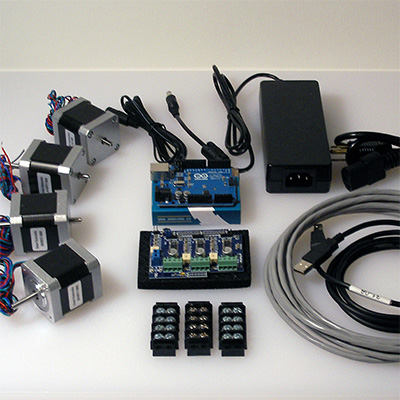

#Assembly Overview

##Welcome!

##Notes
If you have any difficulties with assembly, please check the ShapeOko [wiki](http://www.shapeoko.com/wiki) and [forums](http://www.shapeoko.com/forum/index.php).

###Tools

Only basic tools are required, unless one's MakerSlide needs to be tapped, in which case, in addition to wrenches, wire cutters and an assortment of Allen keys one will need an M5 x 0.8mm thread tap and handle. The 5mm and 8mm wrenches are close enough in size to 5/16" and 1/2" wrenches that one can substitute those, or when one needs 2 8mm wrenches, use a 1/2" and an 8mm. Similarly, the set screws should take a 1.5mm Allen key, but a 1/16" is only slightly larger and may afford better contact and be less likely to round out the screw.

###Screw Sizes

For the most part, it's obvious which size screw is used for what, but the M5 10mm and 12mm BHCS (button head cap screws) are easily confused — while it's not noticeable when the shorter 10mm length is used where one ought to use a 12mm, the 10mm screws are intended for use with MakerSlide insertion nuts and a 12mm screw is too long and will bottom out before beginning to hold anything in place.

###Electronics and Mechanicals

Please note that while the assembly instructions have these two separated, it is probably best to partially disassemble the electronics after testing them and mount the motors onto the appropriate motor mount carriage plates as you are assembling the machine for the Z- and X-axes. Putting this off will require either partial disassembly (Z-axis) or an almost impossible reach into a very cramped space to attach very small screws and washers (Y-axis).

###A Note on Tapping

There is one fabrication-like step which may be necessary, tapping the MakerSlide. If your MakerSlide is not already tapped, and you do not have experience tapping it, it is suggested that you begin as soon as practicable. Do not however, attempt to tap all of the threads in a single session, instead, tap one or two threads, then proceed to the next step in the process. After completing one or two steps, return to tapping. Doing it in this fashion will avoid the tedium of a lengthy session.

Start with the short length which is used for the Z-axis Carriage (it only needs to be tapped at one end, so a failure to tap two good threads at one end will not render it unusable. Tap one thread at either end, then tap one thread in each of the remaining pieces of MakerSlide, then return to the first piece and start over, tapping a single thread in each piece each time. By the time you're done, you'll be a pro (well, good at it anyway) and you won't have one piece which has all bad threads. Don't despair if you strip the threads on a piece — the default bolts for attaching MakerSlide are quite short and this is easily remedied by tapping the stripped holes deeper and using a longer bolt.

#Assembly Steps

##Electronics
In this step, we will *test* our electronics setup. It's beneficial to do this prior to assembling the machine, as some issues are more easily addressed before assembly takes place. If a problem were to occur, it's much easier to troubleshoot without having to disassemble the machine!

[Electronics](01_electronics.html)

---

##V-Wheels and Idlers
A lot of the "work" required to assemble the machine is done in this step. Just like long division, not hard, but it's tedious and takes a while.

[V-Wheels and Idlers](02_vwheels_and_idlers.html)

---

##Carriages
[Carriages](03_carriages.html)

---

##Z-Axis
[Z Axis](04_zaxis.html)

---

##Gantry
[Gantry](05_gantry.html)

---

##Y-Axis
[Y Axis](06_endplates.html)

---

##Work Area##
[Work Area](07_workarea.html)

---

##Electrical Wiring##
[Electrical Wiring](08_wiring.html)

---

##Hello, World
[Hello, World](helloworld.html)

---

##First Job
[First Job](firstjob.html)