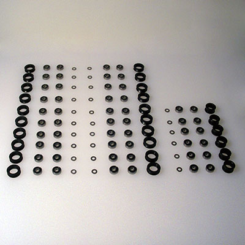
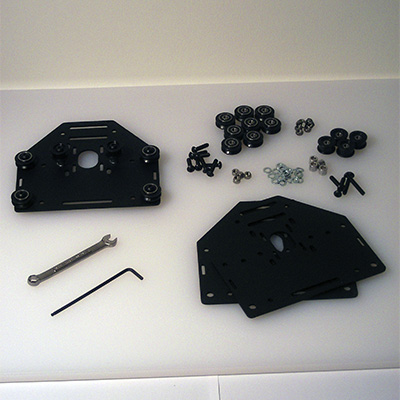
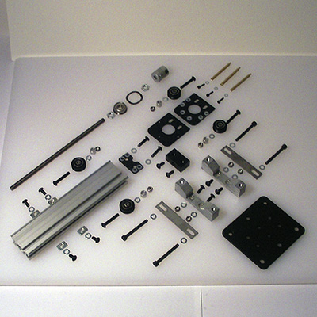
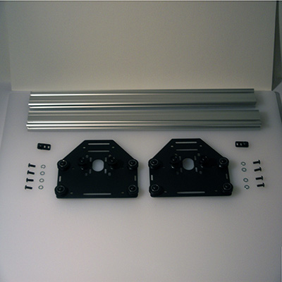
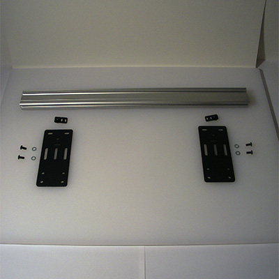
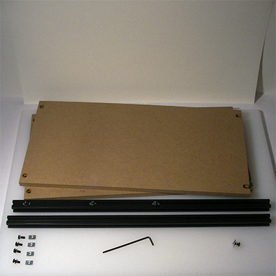
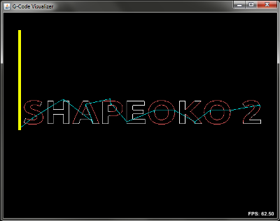
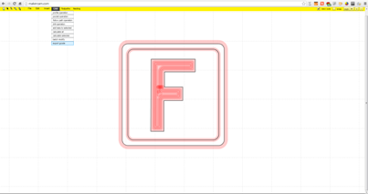

#Assembly Overview

##Welcome!

Thank you for supporting Project Shapeoko. The following pages are filled with all the information you need to assemble your Shapeoko 2 desktop CNC machine.  If you have any difficulties with assembly, please check the ShapeOko [wiki](http://www.shapeoko.com/wiki) and [forums](http://www.shapeoko.com/forum/index.php).

###Tools

Only basic tools are required to assemble the Shapeoko 2. The following tools are included with the full kits [sold through inventables.com](https://www.inventables.com/technologies/desktop-cnc-mill-kit-shapeoko-2). If you are rolling your own full kit (you bought the mechanical kit), use the following list as a guideline for what you will need to assemble the machine.

* Hex Key Set 1.5 / 2.0 / 2.5 / 3.0 / 4.0 mm
* Screw Driver 2.0mm blade
* Wrench 13mm Qty 2
* Wrench 8mm (5/16")
* M5 Tap and handle
* Spiral End Mill
* Safety glasses
* cable ties (100)
* thread lock
* razor blade

###Screw Sizes (lengths)

For the most part, it's obvious which size screw is used for what, but the M5 10mm and 12mm BHCS (button head cap screws) are easily confused — while it's not noticeable when the shorter 10mm length is used where one ought to use a 12mm, the 10mm screws are intended for use with MakerSlide insertion nuts and a 12mm screw is too long and will bottom out before beginning to hold anything in place.

###Electronics and Mechanicals

The assembly instructions have these two steps separated. The first step is for **testing** your electronics. As noted in the details of that step, it's easier to troubleshoot, and if there's a major problem, you won't have to disassemble the machine. It is best to partially disassemble the electronics after testing them in order to mount the motors onto the appropriate motor mount carriage plates. 

###A Note on Tapping

#####Taps Are Brittle - Don't drop them on a cement floor.

The tap has to be harder than the material it's tapping. Because of that hardening, it's brittle, as in easily broken. You want to avoid breaking the tap like you would avoid getting the plague. Use a proper t-handle (like the one included with your kit) to turn the tap. Don't use a wrench, locking pliers, or a vice. yeah, those last three will work, but you'll be playing with fire.

#####Lubricate - a little bit will go a long way.

Lubricating will reduce the amount of friction produced while tapping, making the tap handle easier to turn. It could also aid in chip removal as there will be less friction keeping the chips in. You can use tapping fluid, motor oil, WD-40, butter, PAM, water, spit, or basically anythign that's wet. You won't need a lot of whatever you chose.

#####Take Your Time - this is not a race.

No, seriously this is not a race. You don't want to break one of these things. Not only will you be really mad at yourself, but you'll also have to buy a new piece of makerslide, a new tap, and possibly anything else that you break during your outburst. So, take your time and go slow.

#####You're a Breaker now - a chip breaker that is.

Take a look at your tap. It's not like a screw where the threads go all the way aroundthe body. There are 4 sections of teeth, seperated by vertical gaps called _flutes_. The teeth cut the metal, and the flutes act as an evacuation channel. Yeah, that's right, an evacuation channel. That's bad ass....

Anyway, the flutes keep the chips out of the way so the teeth can keep cutting. Once you feel some resistance, you need to reverse the tap until you feel those chips clear. In some cases (towards the end of the tap) you'll need to reverse it all the way out, clean the tap (just brush off the chips), and then go at it again. The smaller the tap, the easier it is to break. Your tap is an M5 x 0.8mm tap. That's not the smallest tap in the world, but it's not very big either. So, be careful!

The awesome news is that you can hone your tapping skillz (with a z!) by practicing on the z-axis makerslide (the short one that measures 200mm). We only need 1 end of that piece tapped, so if you were to make a mistake while learning, no big deal. Just flip the piece over and use the other side. But, you only get 2 practice holes! Use them wisely.

##Assembly Steps

##Software
[Goto the Instructions](software.html)

Before we can control our machine, we need to install and/or configure some software. If you're going to test your electronics, then you'll need to have this step done before you can complete that step. Otherwise, you'll need to complete this step before running Hello, World. 

---

##Electronics
[Goto the Instructions](01_electronics.html)

In this step, we will *test* our electronics setup. It's beneficial to do this prior to assembling the machine, as some issues are more easily addressed before assembly takes place. If a problem were to occur, it's much easier to troubleshoot without having to disassemble the machine!

---

##V-Wheels and Idlers
[Goto the Instructions](02_vwheels_and_idlers.html)

A lot of the "work" required to assemble the machine is done in this step. It's not hard work, but it'll take a while. Just like long division.

---

##Carriages
[Goto the Instructions](03_carriages.html)

This is the most labor intensive part of the assembly. You will be assembling 3 motor mount plates.

---

##Z-Axis
[Goto the Instructions](04_zaxis.html)

The z-axis is comprised of 3 seperate assemblies, and will require some time (and patience) to fully assemble. once you are done with this step, your machine will really start to take shape. 

---

##Gantry
[Goto the Instructions](05_gantry.html)

---

##Y-Axis
[Goto the Instructions](06_endplates.html)

---

##Work Area##
[Goto the Instructions](07_workarea.html)

---

##Electrical Wiring##
[Goto the Instructions](08_wiring.html)

---

##Hello, World
[Goto the Instructions](helloworld.html)

Your very first run! 

---

##First Job
[Goto the Instructions](firstjob.html)

